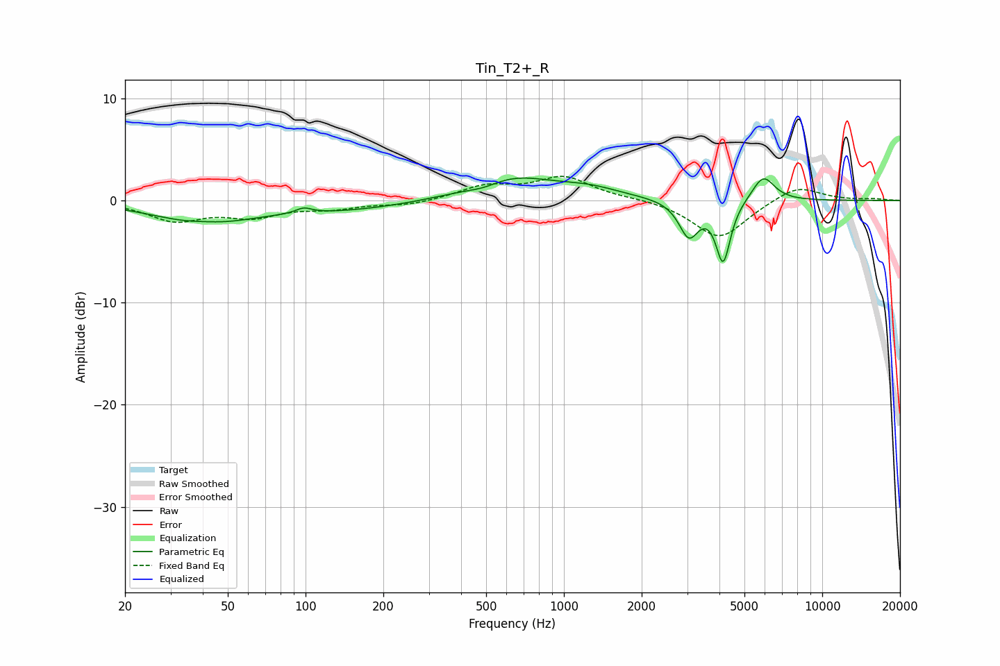

# Tin_T2+_R
See [usage instructions](https://github.com/jaakkopasanen/AutoEq#usage) for more options and info.

### Parametric EQs
Apply preamp of -2.3 dB when using parametric equalizer.

|   # | Type    |   Fc (Hz) |    Q |   Gain (dB) |
|-----|---------|-----------|------|-------------|
|   1 | Peaking |        40 | 0.76 |        -2.1 |
|   2 | Peaking |        40 | 1.95 |         0.3 |
|   3 | Peaking |        98 | 4.57 |         0.5 |
|   4 | Peaking |       142 | 0.53 |        -0.9 |
|   5 | Peaking |       490 | 2.02 |        -0.6 |
|   6 | Peaking |       616 | 0.86 |         2.4 |
|   7 | Peaking |      1258 | 1.15 |         0.9 |
|   8 | Peaking |      3046 | 3.7  |        -3.5 |
|   9 | Peaking |      4134 | 4.99 |        -5.9 |
|  10 | Peaking |      5914 | 3.15 |         2.5 |

### Fixed Band EQs
When using fixed band (also called graphic) equalizer, apply preamp of **-2.5 dB** (if available) and set gains manually with these parameters.

|   # | Type    |   Fc (Hz) |    Q |   Gain (dB) |
|-----|---------|-----------|------|-------------|
|   1 | Peaking |        31 | 1.41 |        -1.9 |
|   2 | Peaking |        62 | 1.41 |        -1.4 |
|   3 | Peaking |       125 | 1.41 |        -0.7 |
|   4 | Peaking |       250 | 1.41 |        -0.5 |
|   5 | Peaking |       500 | 1.41 |         1.3 |
|   6 | Peaking |      1000 | 1.41 |         2.2 |
|   7 | Peaking |      2000 | 1.41 |         0.2 |
|   8 | Peaking |      4000 | 1.41 |        -3.8 |
|   9 | Peaking |      8000 | 1.41 |         1.6 |
|  10 | Peaking |     16000 | 1.41 |         0.1 |

### Graphs

