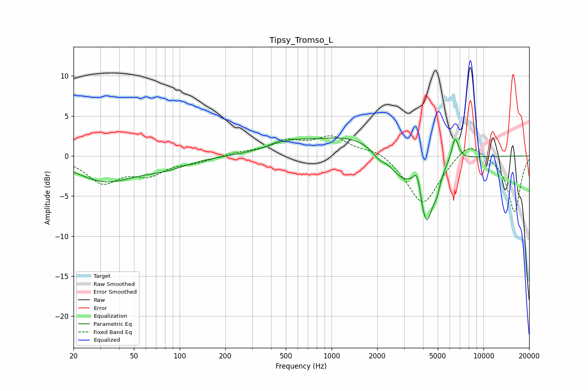

# Tipsy_Tromso_L
See [usage instructions](https://github.com/jaakkopasanen/AutoEq#usage) for more options and info.

### Parametric EQs
Apply preamp of -2.4 dB when using parametric equalizer.

|   # | Type    |   Fc (Hz) |    Q |   Gain (dB) |
|-----|---------|-----------|------|-------------|
|   1 | Peaking |        32 | 0.73 |        -3   |
|   2 | Peaking |        79 | 0.92 |        -1.1 |
|   3 | Peaking |       512 | 1.02 |         1.2 |
|   4 | Peaking |      1312 | 0.6  |         2.3 |
|   5 | Peaking |      2045 | 3.26 |        -0.9 |
|   6 | Peaking |      2881 | 1.73 |        -2.6 |
|   7 | Peaking |      3667 | 5.99 |         2.7 |
|   8 | Peaking |      4201 | 3.04 |        -8   |
|   9 | Peaking |      4927 | 6    |        -1.7 |
|  10 | Peaking |      6507 | 5.99 |         3   |

### Fixed Band EQs
When using fixed band (also called graphic) equalizer, apply preamp of **-2.6 dB** (if available) and set gains manually with these parameters.

|   # | Type    |   Fc (Hz) |    Q |   Gain (dB) |
|-----|---------|-----------|------|-------------|
|   1 | Peaking |        31 | 1.41 |        -3.1 |
|   2 | Peaking |        62 | 1.41 |        -2   |
|   3 | Peaking |       125 | 1.41 |        -0.6 |
|   4 | Peaking |       250 | 1.41 |         0.4 |
|   5 | Peaking |       500 | 1.41 |         1.7 |
|   6 | Peaking |      1000 | 1.41 |         2.3 |
|   7 | Peaking |      2000 | 1.41 |         0.9 |
|   8 | Peaking |      4000 | 1.41 |        -6.2 |
|   9 | Peaking |      8000 | 1.41 |         2.2 |
|  10 | Peaking |     16000 | 1.41 |        -7   |

### Graphs

