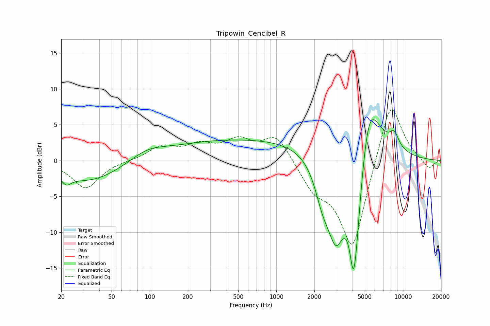

# Tripowin_Cencibel_R
See [usage instructions](https://github.com/jaakkopasanen/AutoEq#usage) for more options and info.

### Parametric EQs
Apply preamp of -5.8 dB when using parametric equalizer.

|   # | Type    |   Fc (Hz) |    Q |   Gain (dB) |
|-----|---------|-----------|------|-------------|
|   1 | Peaking |        22 | 3.78 |        -1.2 |
|   2 | Peaking |        34 | 0.56 |        -3   |
|   3 | Peaking |        95 | 1.03 |         1.3 |
|   4 | Peaking |       683 | 0.18 |         3.1 |
|   5 | Peaking |      2317 | 2.28 |        -4   |
|   6 | Peaking |      2955 | 1.92 |       -10   |
|   7 | Peaking |      4048 | 6    |        -4.4 |
|   8 | Peaking |      4224 | 2.17 |       -15.7 |
|   9 | Peaking |      5345 | 1.43 |        12.5 |
|  10 | Peaking |      8565 | 3.62 |         1.9 |

### Fixed Band EQs
When using fixed band (also called graphic) equalizer, apply preamp of **-7.2 dB** (if available) and set gains manually with these parameters.

|   # | Type    |   Fc (Hz) |    Q |   Gain (dB) |
|-----|---------|-----------|------|-------------|
|   1 | Peaking |        31 | 1.41 |        -3.9 |
|   2 | Peaking |        62 | 1.41 |        -0   |
|   3 | Peaking |       125 | 1.41 |         1.8 |
|   4 | Peaking |       250 | 1.41 |         1.8 |
|   5 | Peaking |       500 | 1.41 |         2.5 |
|   6 | Peaking |      1000 | 1.41 |         3.6 |
|   7 | Peaking |      2000 | 1.41 |        -3.3 |
|   8 | Peaking |      4000 | 1.41 |       -12.7 |
|   9 | Peaking |      8000 | 1.41 |         9.3 |
|  10 | Peaking |     16000 | 1.41 |        -1.3 |

### Graphs

