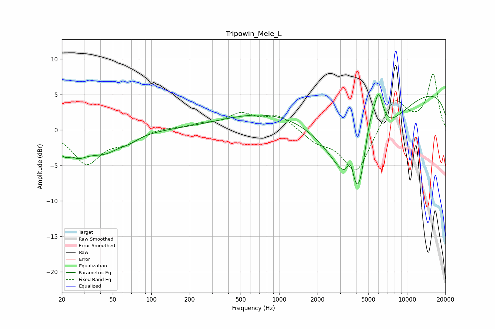

# Tripowin_Mele_L
See [usage instructions](https://github.com/jaakkopasanen/AutoEq#usage) for more options and info.

### Parametric EQs
Apply preamp of -5.1 dB when using parametric equalizer.

|   # | Type    |   Fc (Hz) |    Q |   Gain (dB) |
|-----|---------|-----------|------|-------------|
|   1 | Peaking |        23 | 1.16 |        -3.9 |
|   2 | Peaking |        24 | 4.78 |         0.7 |
|   3 | Peaking |        44 | 1.27 |        -2.1 |
|   4 | Peaking |        68 | 1.78 |        -0.8 |
|   5 | Peaking |      3628 | 4.58 |         4.2 |
|   6 | Peaking |      4177 | 1.06 |       -18.2 |
|   7 | Peaking |      4569 | 0.28 |       -17.2 |
|   8 | Peaking |      5051 | 1.84 |        10   |
|   9 | Peaking |      5268 | 0.18 |        20   |
|  10 | Peaking |      6014 | 3.88 |         5   |

### Fixed Band EQs
When using fixed band (also called graphic) equalizer, apply preamp of **-8.0 dB** (if available) and set gains manually with these parameters.

|   # | Type    |   Fc (Hz) |    Q |   Gain (dB) |
|-----|---------|-----------|------|-------------|
|   1 | Peaking |        31 | 1.41 |        -4.6 |
|   2 | Peaking |        62 | 1.41 |        -1.5 |
|   3 | Peaking |       125 | 1.41 |         0.3 |
|   4 | Peaking |       250 | 1.41 |         0.7 |
|   5 | Peaking |       500 | 1.41 |         2.1 |
|   6 | Peaking |      1000 | 1.41 |         2   |
|   7 | Peaking |      2000 | 1.41 |        -1.5 |
|   8 | Peaking |      4000 | 1.41 |        -6.2 |
|   9 | Peaking |      8000 | 1.41 |         4.6 |
|  10 | Peaking |     16000 | 1.41 |         7.8 |

### Graphs

