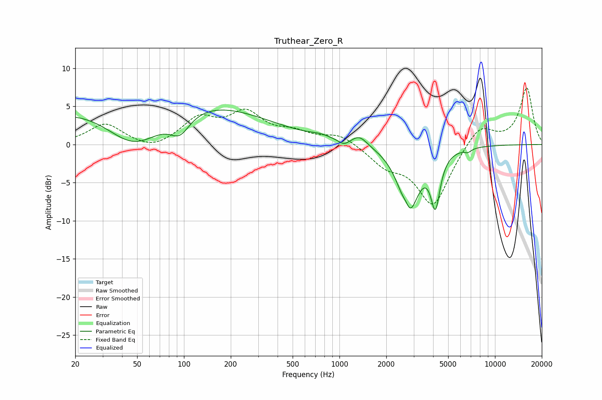

# Truthear_Zero_R
See [usage instructions](https://github.com/jaakkopasanen/AutoEq#usage) for more options and info.

### Parametric EQs
Apply preamp of -4.6 dB when using parametric equalizer.

|   # | Type    |   Fc (Hz) |    Q |   Gain (dB) |
|-----|---------|-----------|------|-------------|
|   1 | Peaking |        48 | 0.72 |        -6.5 |
|   2 | Peaking |        60 | 0.18 |         7.2 |
|   3 | Peaking |        94 | 2.17 |        -2.6 |
|   4 | Peaking |       754 | 2.08 |         0.4 |
|   5 | Peaking |      1071 | 3.92 |        -0.7 |
|   6 | Peaking |      1344 | 2.79 |         1.3 |
|   7 | Peaking |      2685 | 5.92 |         1.5 |
|   8 | Peaking |      2780 | 2.29 |        -9.1 |
|   9 | Peaking |      4141 | 4.76 |        -6.6 |
|  10 | Peaking |      6688 | 5.99 |        -0.4 |

### Fixed Band EQs
When using fixed band (also called graphic) equalizer, apply preamp of **-7.5 dB** (if available) and set gains manually with these parameters.

|   # | Type    |   Fc (Hz) |    Q |   Gain (dB) |
|-----|---------|-----------|------|-------------|
|   1 | Peaking |        31 | 1.41 |         2.7 |
|   2 | Peaking |        62 | 1.41 |        -1   |
|   3 | Peaking |       125 | 1.41 |         3.2 |
|   4 | Peaking |       250 | 1.41 |         3.8 |
|   5 | Peaking |       500 | 1.41 |         1.3 |
|   6 | Peaking |      1000 | 1.41 |         1.4 |
|   7 | Peaking |      2000 | 1.41 |        -2.3 |
|   8 | Peaking |      4000 | 1.41 |        -7.9 |
|   9 | Peaking |      8000 | 1.41 |         2.8 |
|  10 | Peaking |     16000 | 1.41 |         7.4 |

### Graphs

