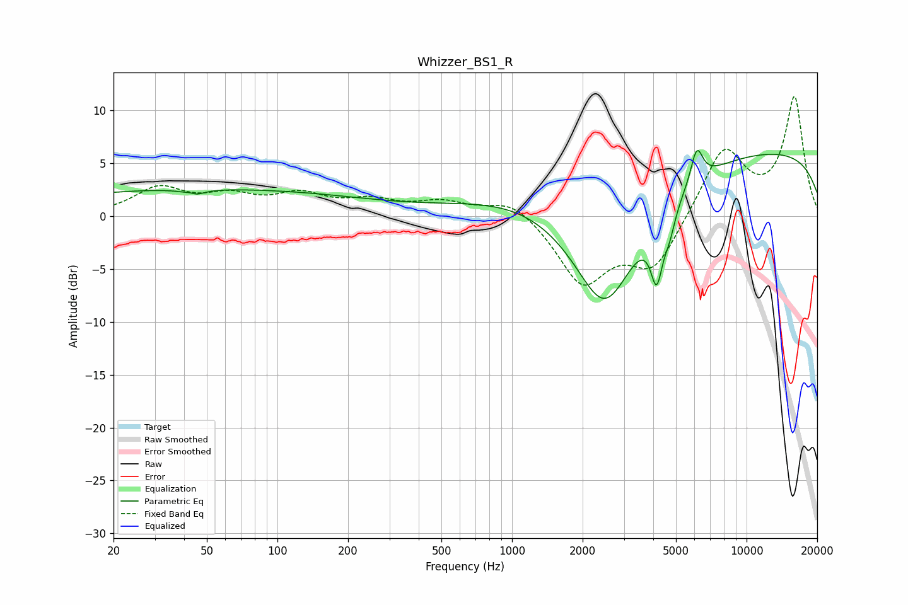

# Whizzer_BS1_R
See [usage instructions](https://github.com/jaakkopasanen/AutoEq#usage) for more options and info.

### Parametric EQs
Apply preamp of -6.3 dB when using parametric equalizer.

|   # | Type    |   Fc (Hz) |    Q |   Gain (dB) |
|-----|---------|-----------|------|-------------|
|   1 | Peaking |        43 | 5.02 |         2   |
|   2 | Peaking |        43 | 4.49 |        -2.4 |
|   3 | Peaking |        48 | 0.18 |         2.6 |
|   4 | Peaking |      1334 | 0.47 |         2.8 |
|   5 | Peaking |      2485 | 0.88 |       -13.4 |
|   6 | Peaking |      3523 | 2.84 |         0.1 |
|   7 | Peaking |      4139 | 5.42 |        -5.5 |
|   8 | Peaking |      4692 | 5.45 |        -2   |
|   9 | Peaking |      6133 | 5.31 |         3.3 |
|  10 | Peaking |     10000 | 0.18 |         6.4 |

### Fixed Band EQs
When using fixed band (also called graphic) equalizer, apply preamp of **-11.4 dB** (if available) and set gains manually with these parameters.

|   # | Type    |   Fc (Hz) |    Q |   Gain (dB) |
|-----|---------|-----------|------|-------------|
|   1 | Peaking |        31 | 1.41 |         2.5 |
|   2 | Peaking |        62 | 1.41 |         1.6 |
|   3 | Peaking |       125 | 1.41 |         1.8 |
|   4 | Peaking |       250 | 1.41 |         1.2 |
|   5 | Peaking |       500 | 1.41 |         1.2 |
|   6 | Peaking |      1000 | 1.41 |         1.7 |
|   7 | Peaking |      2000 | 1.41 |        -6.2 |
|   8 | Peaking |      4000 | 1.41 |        -4.8 |
|   9 | Peaking |      8000 | 1.41 |         6.5 |
|  10 | Peaking |     16000 | 1.41 |        11.1 |

### Graphs

