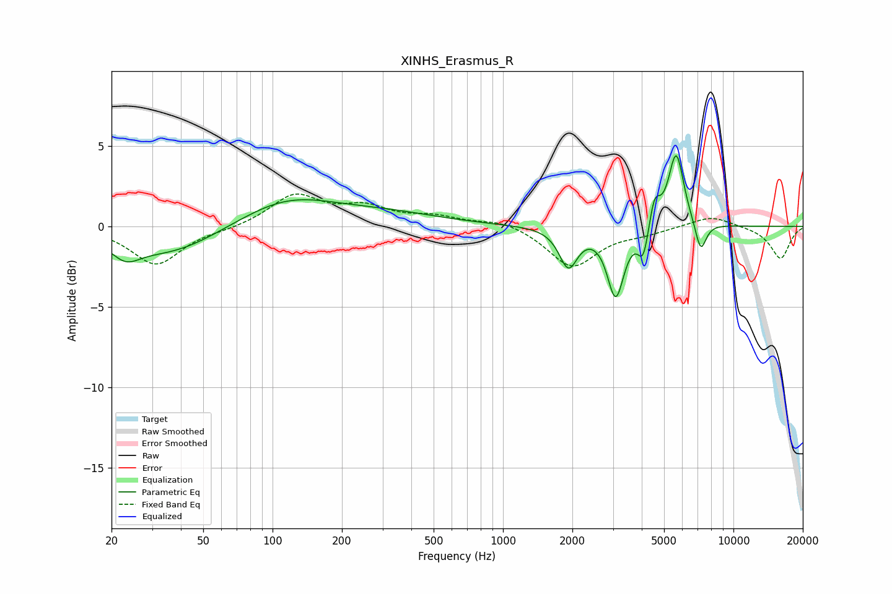

# XINHS_Erasmus_R
See [usage instructions](https://github.com/jaakkopasanen/AutoEq#usage) for more options and info.

### Parametric EQs
Apply preamp of -4.5 dB when using parametric equalizer.

|   # | Type    |   Fc (Hz) |    Q |   Gain (dB) |
|-----|---------|-----------|------|-------------|
|   1 | Peaking |        23 | 2.29 |        -1   |
|   2 | Peaking |        36 | 0.65 |        -1.8 |
|   3 | Peaking |       116 | 0.65 |         1.8 |
|   4 | Peaking |       326 | 0.61 |         0.6 |
|   5 | Peaking |      1922 | 3.57 |        -2.4 |
|   6 | Peaking |      3084 | 3.91 |        -4.3 |
|   7 | Peaking |      4064 | 6    |        -2   |
|   8 | Peaking |      4543 | 5.99 |         1.8 |
|   9 | Peaking |      5644 | 4.15 |         4.6 |
|  10 | Peaking |      7209 | 5.6  |        -1.9 |

### Fixed Band EQs
When using fixed band (also called graphic) equalizer, apply preamp of **-2.1 dB** (if available) and set gains manually with these parameters.

|   # | Type    |   Fc (Hz) |    Q |   Gain (dB) |
|-----|---------|-----------|------|-------------|
|   1 | Peaking |        31 | 1.41 |        -2.4 |
|   2 | Peaking |        62 | 1.41 |        -0.2 |
|   3 | Peaking |       125 | 1.41 |         1.9 |
|   4 | Peaking |       250 | 1.41 |         1   |
|   5 | Peaking |       500 | 1.41 |         0.5 |
|   6 | Peaking |      1000 | 1.41 |         0.4 |
|   7 | Peaking |      2000 | 1.41 |        -2.5 |
|   8 | Peaking |      4000 | 1.41 |        -0.3 |
|   9 | Peaking |      8000 | 1.41 |         0.7 |
|  10 | Peaking |     16000 | 1.41 |        -2   |

### Graphs

