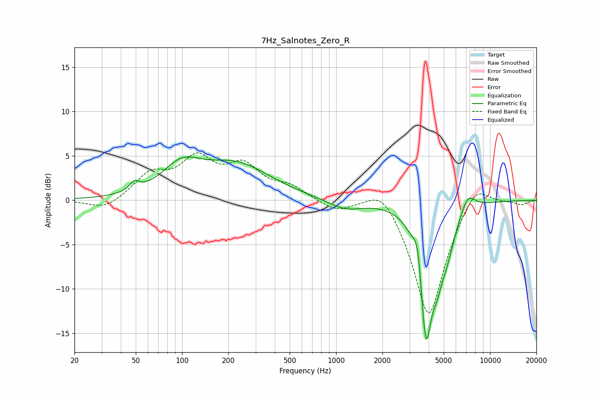

# 7Hz_Salnotes_Zero_R
See [usage instructions](https://github.com/jaakkopasanen/AutoEq#usage) for more options and info.

### Parametric EQs
Apply preamp of -5.0 dB when using parametric equalizer.

|   # | Type    |   Fc (Hz) |    Q |   Gain (dB) |
|-----|---------|-----------|------|-------------|
|   1 | Peaking |        49 | 4.66 |         1   |
|   2 | Peaking |        99 | 1.14 |         3.1 |
|   3 | Peaking |       224 | 0.63 |         3.8 |
|   4 | Peaking |      1143 | 1.25 |        -1.1 |
|   5 | Peaking |      3386 | 5.64 |         3.4 |
|   6 | Peaking |      3509 | 1.19 |         1   |
|   7 | Peaking |      3834 | 3.1  |       -15.7 |
|   8 | Peaking |      4517 | 4.53 |        -2.4 |
|   9 | Peaking |      5190 | 2.39 |        -4.2 |
|  10 | Peaking |      7168 | 2.91 |         2   |

### Fixed Band EQs
When using fixed band (also called graphic) equalizer, apply preamp of **-5.4 dB** (if available) and set gains manually with these parameters.

|   # | Type    |   Fc (Hz) |    Q |   Gain (dB) |
|-----|---------|-----------|------|-------------|
|   1 | Peaking |        31 | 1.41 |        -1.2 |
|   2 | Peaking |        62 | 1.41 |         2.7 |
|   3 | Peaking |       125 | 1.41 |         4.2 |
|   4 | Peaking |       250 | 1.41 |         3.4 |
|   5 | Peaking |       500 | 1.41 |         1.3 |
|   6 | Peaking |      1000 | 1.41 |        -1.2 |
|   7 | Peaking |      2000 | 1.41 |         2.5 |
|   8 | Peaking |      4000 | 1.41 |       -13.5 |
|   9 | Peaking |      8000 | 1.41 |         2.8 |
|  10 | Peaking |     16000 | 1.41 |        -0.5 |

### Graphs

