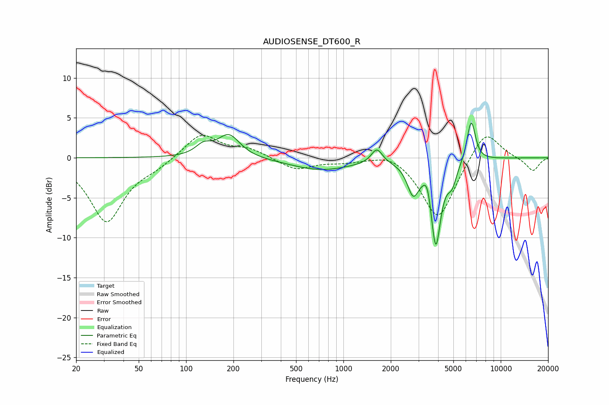

# AUDIOSENSE_DT600_R
See [usage instructions](https://github.com/jaakkopasanen/AutoEq#usage) for more options and info.

### Parametric EQs
Apply preamp of -4.5 dB when using parametric equalizer.

|   # | Type    |   Fc (Hz) |    Q |   Gain (dB) |
|-----|---------|-----------|------|-------------|
|   1 | Peaking |       129 | 2.81 |         1.3 |
|   2 | Peaking |       187 | 2.01 |         2.9 |
|   3 | Peaking |       719 | 0.72 |        -1.5 |
|   4 | Peaking |      1631 | 4.07 |         1.9 |
|   5 | Peaking |      2774 | 3.82 |        -3.7 |
|   6 | Peaking |      3416 | 5.99 |         2   |
|   7 | Peaking |      3864 | 4.35 |       -10.7 |
|   8 | Peaking |      4909 | 4.83 |        -2.2 |
|   9 | Peaking |      6356 | 5.93 |         1.7 |
|  10 | Peaking |      6563 | 5.4  |         3.6 |

### Fixed Band EQs
When using fixed band (also called graphic) equalizer, apply preamp of **-2.9 dB** (if available) and set gains manually with these parameters.

|   # | Type    |   Fc (Hz) |    Q |   Gain (dB) |
|-----|---------|-----------|------|-------------|
|   1 | Peaking |        31 | 1.41 |        -8   |
|   2 | Peaking |        62 | 1.41 |        -0.9 |
|   3 | Peaking |       125 | 1.41 |         3.1 |
|   4 | Peaking |       250 | 1.41 |         1   |
|   5 | Peaking |       500 | 1.41 |        -1.5 |
|   6 | Peaking |      1000 | 1.41 |        -0.4 |
|   7 | Peaking |      2000 | 1.41 |         0.9 |
|   8 | Peaking |      4000 | 1.41 |        -7.8 |
|   9 | Peaking |      8000 | 1.41 |         3.8 |
|  10 | Peaking |     16000 | 1.41 |        -1.7 |

### Graphs

