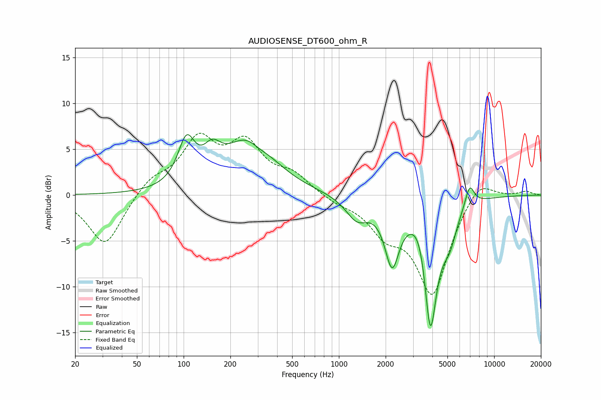

# AUDIOSENSE_DT600_ohm_R
See [usage instructions](https://github.com/jaakkopasanen/AutoEq#usage) for more options and info.

### Parametric EQs
Apply preamp of -6.7 dB when using parametric equalizer.

|   # | Type    |   Fc (Hz) |    Q |   Gain (dB) |
|-----|---------|-----------|------|-------------|
|   1 | Peaking |       104 | 2.63 |         4.8 |
|   2 | Peaking |       153 | 2.54 |         2.4 |
|   3 | Peaking |       268 | 0.91 |         6.2 |
|   4 | Peaking |       302 | 2.12 |        -1   |
|   5 | Peaking |      1307 | 1.95 |        -2.4 |
|   6 | Peaking |      2201 | 3.01 |        -6.6 |
|   7 | Peaking |      3369 | 2.59 |         2.7 |
|   8 | Peaking |      3882 | 3.01 |       -14.9 |
|   9 | Peaking |      5173 | 3.07 |        -2.8 |
|  10 | Peaking |      6947 | 4.54 |         2.4 |

### Fixed Band EQs
When using fixed band (also called graphic) equalizer, apply preamp of **-6.8 dB** (if available) and set gains manually with these parameters.

|   # | Type    |   Fc (Hz) |    Q |   Gain (dB) |
|-----|---------|-----------|------|-------------|
|   1 | Peaking |        31 | 1.41 |        -5.6 |
|   2 | Peaking |        62 | 1.41 |         1.7 |
|   3 | Peaking |       125 | 1.41 |         5.6 |
|   4 | Peaking |       250 | 1.41 |         5   |
|   5 | Peaking |       500 | 1.41 |         1.9 |
|   6 | Peaking |      1000 | 1.41 |        -0.7 |
|   7 | Peaking |      2000 | 1.41 |        -3.3 |
|   8 | Peaking |      4000 | 1.41 |       -10.6 |
|   9 | Peaking |      8000 | 1.41 |         2.3 |
|  10 | Peaking |     16000 | 1.41 |         0.4 |

### Graphs

