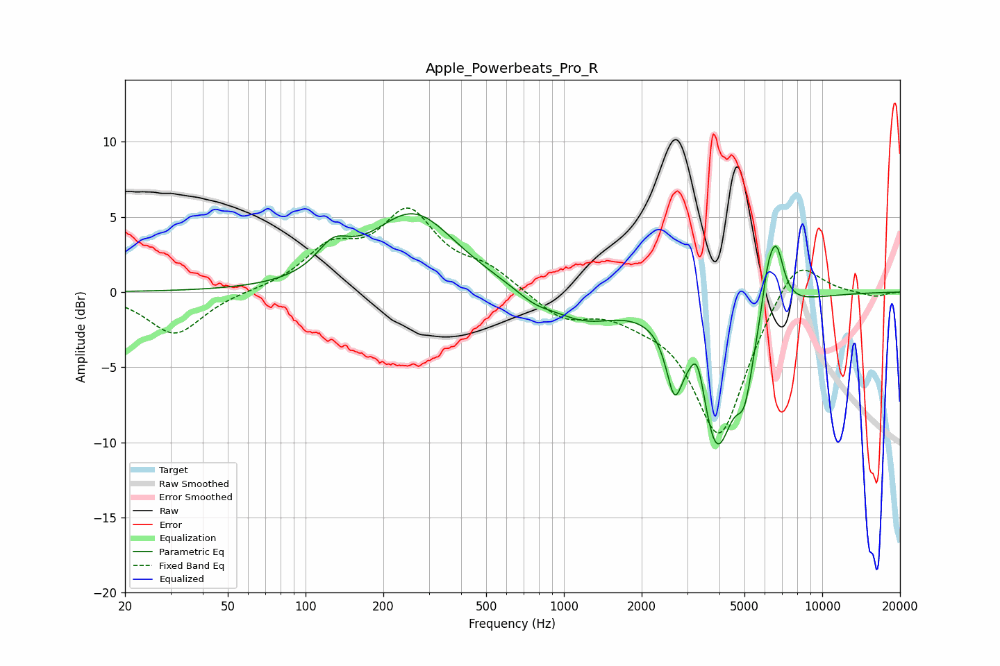

# Apple_Powerbeats_Pro_R
See [usage instructions](https://github.com/jaakkopasanen/AutoEq#usage) for more options and info.

### Parametric EQs
Apply preamp of -5.3 dB when using parametric equalizer.

|   # | Type    |   Fc (Hz) |    Q |   Gain (dB) |
|-----|---------|-----------|------|-------------|
|   1 | Peaking |       128 | 2.22 |         1.8 |
|   2 | Peaking |       262 | 0.86 |         5.2 |
|   3 | Peaking |       768 | 2    |        -0.6 |
|   4 | Peaking |      1191 | 1.07 |        -1.7 |
|   5 | Peaking |      2678 | 4.61 |        -3.8 |
|   6 | Peaking |      3296 | 5.01 |         2.7 |
|   7 | Peaking |      3898 | 1.93 |       -10   |
|   8 | Peaking |      5012 | 4.44 |        -3.4 |
|   9 | Peaking |      6149 | 5.9  |         2.2 |
|  10 | Peaking |      6639 | 4.52 |         4.1 |

### Fixed Band EQs
When using fixed band (also called graphic) equalizer, apply preamp of **-5.7 dB** (if available) and set gains manually with these parameters.

|   # | Type    |   Fc (Hz) |    Q |   Gain (dB) |
|-----|---------|-----------|------|-------------|
|   1 | Peaking |        31 | 1.41 |        -2.9 |
|   2 | Peaking |        62 | 1.41 |         0   |
|   3 | Peaking |       125 | 1.41 |         2.6 |
|   4 | Peaking |       250 | 1.41 |         5   |
|   5 | Peaking |       500 | 1.41 |         1.3 |
|   6 | Peaking |      1000 | 1.41 |        -1.7 |
|   7 | Peaking |      2000 | 1.41 |        -0.9 |
|   8 | Peaking |      4000 | 1.41 |        -9.6 |
|   9 | Peaking |      8000 | 1.41 |         2.9 |
|  10 | Peaking |     16000 | 1.41 |        -0.3 |

### Graphs

