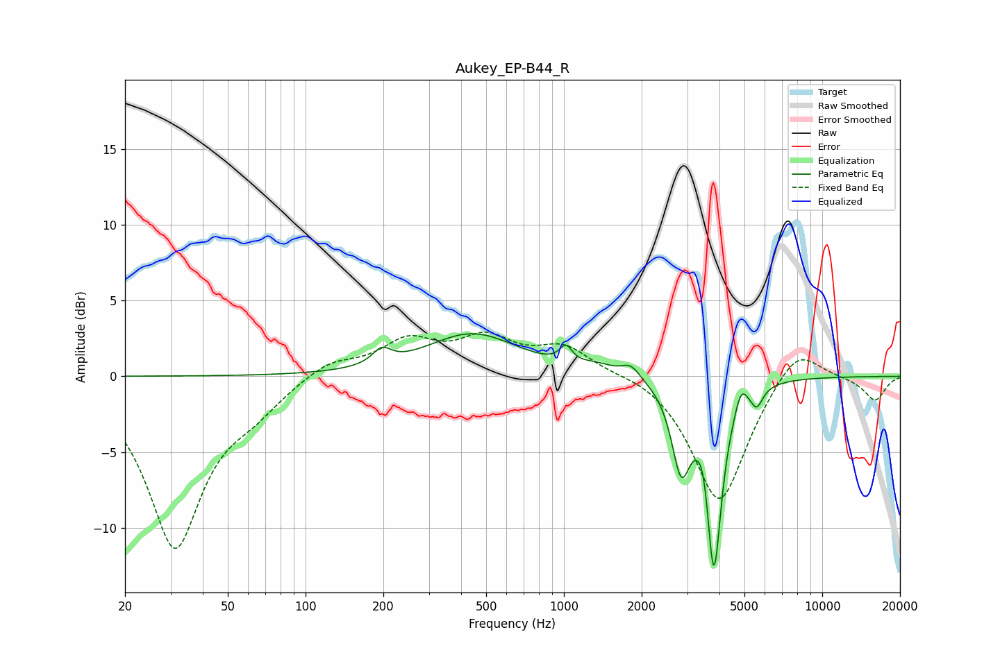

# Aukey_EP-B44_R
See [usage instructions](https://github.com/jaakkopasanen/AutoEq#usage) for more options and info.

### Parametric EQs
Apply preamp of -2.9 dB when using parametric equalizer.

|   # | Type    |   Fc (Hz) |    Q |   Gain (dB) |
|-----|---------|-----------|------|-------------|
|   1 | Peaking |       197 | 3.99 |         1   |
|   2 | Peaking |       442 | 0.79 |         2.8 |
|   3 | Peaking |      1018 | 6    |         1.1 |
|   4 | Peaking |      1343 | 2.18 |         0.5 |
|   5 | Peaking |      1816 | 3.97 |         0.8 |
|   6 | Peaking |      2843 | 3.91 |        -5.4 |
|   7 | Peaking |      3490 | 6    |         1.5 |
|   8 | Peaking |      3805 | 4.65 |       -12.7 |
|   9 | Peaking |      4850 | 6    |         1.3 |
|  10 | Peaking |      5574 | 6    |        -1.3 |

### Fixed Band EQs
When using fixed band (also called graphic) equalizer, apply preamp of **-3.0 dB** (if available) and set gains manually with these parameters.

|   # | Type    |   Fc (Hz) |    Q |   Gain (dB) |
|-----|---------|-----------|------|-------------|
|   1 | Peaking |        31 | 1.41 |       -11.2 |
|   2 | Peaking |        62 | 1.41 |        -1.4 |
|   3 | Peaking |       125 | 1.41 |         1.1 |
|   4 | Peaking |       250 | 1.41 |         2.2 |
|   5 | Peaking |       500 | 1.41 |         2.2 |
|   6 | Peaking |      1000 | 1.41 |         1.8 |
|   7 | Peaking |      2000 | 1.41 |         0.4 |
|   8 | Peaking |      4000 | 1.41 |        -8.5 |
|   9 | Peaking |      8000 | 1.41 |         2.4 |
|  10 | Peaking |     16000 | 1.41 |        -1.6 |

### Graphs

