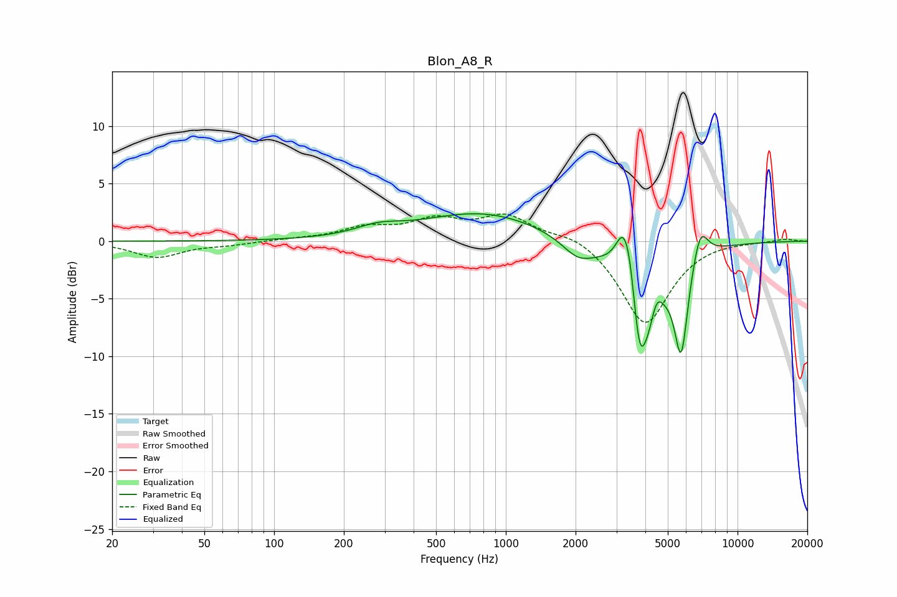

# Blon_A8_R
See [usage instructions](https://github.com/jaakkopasanen/AutoEq#usage) for more options and info.

### Parametric EQs
Apply preamp of -2.5 dB when using parametric equalizer.

|   # | Type    |   Fc (Hz) |    Q |   Gain (dB) |
|-----|---------|-----------|------|-------------|
|   1 | Peaking |       281 | 1.45 |         0.8 |
|   2 | Peaking |       791 | 0.54 |         2.5 |
|   3 | Peaking |      2052 | 2    |        -1.6 |
|   4 | Peaking |      3224 | 3.88 |         4.5 |
|   5 | Peaking |      3434 | 5.52 |         2.2 |
|   6 | Peaking |      3768 | 6    |        -3.2 |
|   7 | Peaking |      3962 | 1.96 |        -8.8 |
|   8 | Peaking |      4467 | 5.47 |         2.1 |
|   9 | Peaking |      5712 | 4.71 |        -8.2 |
|  10 | Peaking |      6901 | 4.12 |         2.9 |

### Fixed Band EQs
When using fixed band (also called graphic) equalizer, apply preamp of **-2.5 dB** (if available) and set gains manually with these parameters.

|   # | Type    |   Fc (Hz) |    Q |   Gain (dB) |
|-----|---------|-----------|------|-------------|
|   1 | Peaking |        31 | 1.41 |        -1.4 |
|   2 | Peaking |        62 | 1.41 |        -0.3 |
|   3 | Peaking |       125 | 1.41 |         0.2 |
|   4 | Peaking |       250 | 1.41 |         1.1 |
|   5 | Peaking |       500 | 1.41 |         1.7 |
|   6 | Peaking |      1000 | 1.41 |         2.1 |
|   7 | Peaking |      2000 | 1.41 |         0.8 |
|   8 | Peaking |      4000 | 1.41 |        -7.3 |
|   9 | Peaking |      8000 | 1.41 |         0.1 |
|  10 | Peaking |     16000 | 1.41 |         0.2 |

### Graphs

