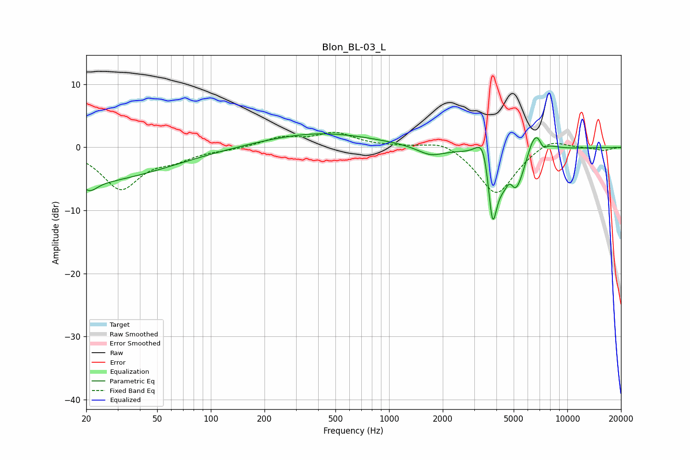

# Blon_BL-03_L
See [usage instructions](https://github.com/jaakkopasanen/AutoEq#usage) for more options and info.

### Parametric EQs
Apply preamp of -2.2 dB when using parametric equalizer.

|   # | Type    |   Fc (Hz) |    Q |   Gain (dB) |
|-----|---------|-----------|------|-------------|
|   1 | Peaking |        20 | 0.32 |        -5.5 |
|   2 | Peaking |        21 | 3.53 |        -1.4 |
|   3 | Peaking |       407 | 0.46 |         2.3 |
|   4 | Peaking |      1707 | 1.93 |        -1.4 |
|   5 | Peaking |      3402 | 3.42 |         5.5 |
|   6 | Peaking |      3800 | 5.3  |       -11.3 |
|   7 | Peaking |      4767 | 5.5  |         3.4 |
|   8 | Peaking |      4957 | 1.98 |       -10   |
|   9 | Peaking |      6614 | 2.4  |         5.8 |
|  10 | Peaking |      7312 | 5.74 |        -1.7 |

### Fixed Band EQs
When using fixed band (also called graphic) equalizer, apply preamp of **-2.5 dB** (if available) and set gains manually with these parameters.

|   # | Type    |   Fc (Hz) |    Q |   Gain (dB) |
|-----|---------|-----------|------|-------------|
|   1 | Peaking |        31 | 1.41 |        -6.4 |
|   2 | Peaking |        62 | 1.41 |        -1.5 |
|   3 | Peaking |       125 | 1.41 |        -0.3 |
|   4 | Peaking |       250 | 1.41 |         1.5 |
|   5 | Peaking |       500 | 1.41 |         2.1 |
|   6 | Peaking |      1000 | 1.41 |         0.1 |
|   7 | Peaking |      2000 | 1.41 |         1.4 |
|   8 | Peaking |      4000 | 1.41 |        -7.6 |
|   9 | Peaking |      8000 | 1.41 |         1.7 |
|  10 | Peaking |     16000 | 1.41 |        -0.5 |

### Graphs

