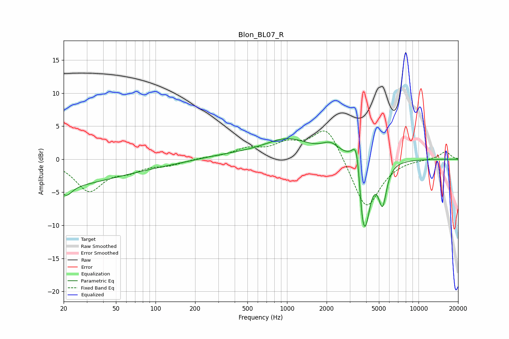

# Blon_BL07_R
See [usage instructions](https://github.com/jaakkopasanen/AutoEq#usage) for more options and info.

### Parametric EQs
Apply preamp of -3.2 dB when using parametric equalizer.

|   # | Type    |   Fc (Hz) |    Q |   Gain (dB) |
|-----|---------|-----------|------|-------------|
|   1 | Peaking |        21 | 3.3  |        -1.7 |
|   2 | Peaking |        51 | 0.18 |        -5.5 |
|   3 | Peaking |       125 | 0.28 |         3.8 |
|   4 | Peaking |      1016 | 0.82 |         2.8 |
|   5 | Peaking |      2150 | 2.12 |         1.7 |
|   6 | Peaking |      3397 | 5.5  |         3.5 |
|   7 | Peaking |      3406 | 2.77 |         2.7 |
|   8 | Peaking |      3720 | 6    |        -4.3 |
|   9 | Peaking |      3946 | 3.53 |        -9.6 |
|  10 | Peaking |      5326 | 4.52 |        -6   |

### Fixed Band EQs
When using fixed band (also called graphic) equalizer, apply preamp of **-4.4 dB** (if available) and set gains manually with these parameters.

|   # | Type    |   Fc (Hz) |    Q |   Gain (dB) |
|-----|---------|-----------|------|-------------|
|   1 | Peaking |        31 | 1.41 |        -4.6 |
|   2 | Peaking |        62 | 1.41 |        -1.4 |
|   3 | Peaking |       125 | 1.41 |        -0.7 |
|   4 | Peaking |       250 | 1.41 |         0.2 |
|   5 | Peaking |       500 | 1.41 |         1.4 |
|   6 | Peaking |      1000 | 1.41 |         2   |
|   7 | Peaking |      2000 | 1.41 |         5.2 |
|   8 | Peaking |      4000 | 1.41 |        -7.9 |
|   9 | Peaking |      8000 | 1.41 |         0.1 |
|  10 | Peaking |     16000 | 1.41 |         1.2 |

### Graphs

