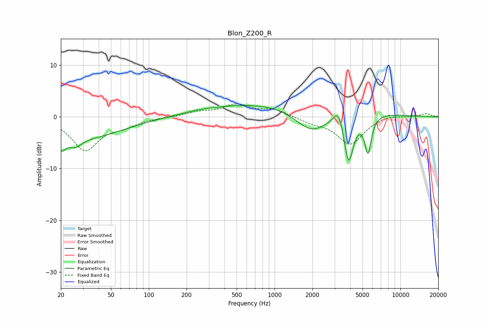

# Blon_Z200_R
See [usage instructions](https://github.com/jaakkopasanen/AutoEq#usage) for more options and info.

### Parametric EQs
Apply preamp of -2.3 dB when using parametric equalizer.

|   # | Type    |   Fc (Hz) |    Q |   Gain (dB) |
|-----|---------|-----------|------|-------------|
|   1 | Peaking |        20 | 3.85 |        -3.1 |
|   2 | Peaking |        26 | 2.64 |        -1.9 |
|   3 | Peaking |        34 | 0.51 |        -3.7 |
|   4 | Peaking |       253 | 1.31 |         0.2 |
|   5 | Peaking |      1266 | 0.2  |         3   |
|   6 | Peaking |      1968 | 1.05 |        -5   |
|   7 | Peaking |      3007 | 6    |         0.3 |
|   8 | Peaking |      3247 | 3.94 |         3.2 |
|   9 | Peaking |      3876 | 3.58 |        -9.8 |
|  10 | Peaking |      5529 | 5.31 |        -7   |

### Fixed Band EQs
When using fixed band (also called graphic) equalizer, apply preamp of **-2.6 dB** (if available) and set gains manually with these parameters.

|   # | Type    |   Fc (Hz) |    Q |   Gain (dB) |
|-----|---------|-----------|------|-------------|
|   1 | Peaking |        31 | 1.41 |        -6.3 |
|   2 | Peaking |        62 | 1.41 |        -1.4 |
|   3 | Peaking |       125 | 1.41 |        -0.1 |
|   4 | Peaking |       250 | 1.41 |         0.8 |
|   5 | Peaking |       500 | 1.41 |         2.2 |
|   6 | Peaking |      1000 | 1.41 |         1.3 |
|   7 | Peaking |      2000 | 1.41 |        -0.9 |
|   8 | Peaking |      4000 | 1.41 |        -5.2 |
|   9 | Peaking |      8000 | 1.41 |         0.5 |
|  10 | Peaking |     16000 | 1.41 |         0.7 |

### Graphs

