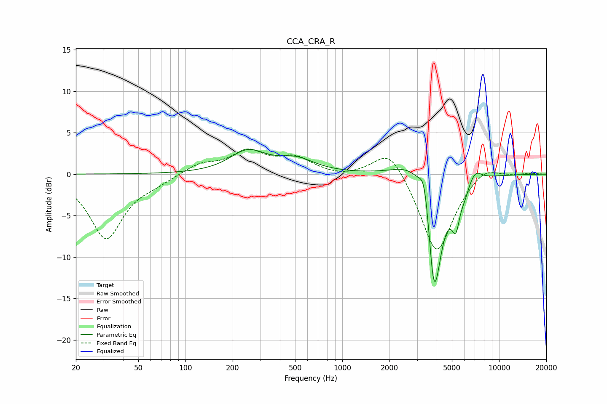

# CCA_CRA_R
See [usage instructions](https://github.com/jaakkopasanen/AutoEq#usage) for more options and info.

### Parametric EQs
Apply preamp of -3.1 dB when using parametric equalizer.

|   # | Type    |   Fc (Hz) |    Q |   Gain (dB) |
|-----|---------|-----------|------|-------------|
|   1 | Peaking |       249 | 1.25 |         2.6 |
|   2 | Peaking |       507 | 1.21 |         1.6 |
|   3 | Peaking |       905 | 1.7  |         0   |
|   4 | Peaking |      2898 | 1.24 |         2.7 |
|   5 | Peaking |      3343 | 4.65 |         4   |
|   6 | Peaking |      3803 | 6    |        -3.3 |
|   7 | Peaking |      3914 | 2.55 |       -12.6 |
|   8 | Peaking |      5298 | 5.15 |        -4.2 |
|   9 | Peaking |      6054 | 6    |        -0.9 |
|  10 | Peaking |      7062 | 3.48 |         1.3 |

### Fixed Band EQs
When using fixed band (also called graphic) equalizer, apply preamp of **-3.1 dB** (if available) and set gains manually with these parameters.

|   # | Type    |   Fc (Hz) |    Q |   Gain (dB) |
|-----|---------|-----------|------|-------------|
|   1 | Peaking |        31 | 1.41 |        -7.7 |
|   2 | Peaking |        62 | 1.41 |        -0.7 |
|   3 | Peaking |       125 | 1.41 |         1.2 |
|   4 | Peaking |       250 | 1.41 |         2.6 |
|   5 | Peaking |       500 | 1.41 |         1.8 |
|   6 | Peaking |      1000 | 1.41 |        -0.4 |
|   7 | Peaking |      2000 | 1.41 |         3.6 |
|   8 | Peaking |      4000 | 1.41 |        -9.9 |
|   9 | Peaking |      8000 | 1.41 |         1.4 |
|  10 | Peaking |     16000 | 1.41 |         0.1 |

### Graphs

