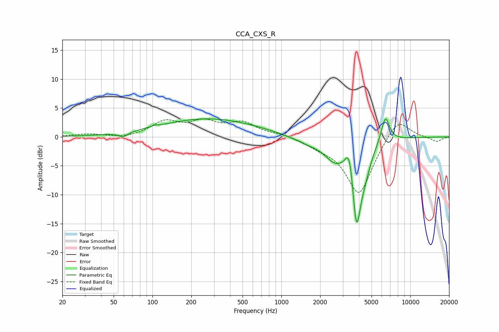

# CCA_CXS_R
See [usage instructions](https://github.com/jaakkopasanen/AutoEq#usage) for more options and info.

### Parametric EQs
Apply preamp of -3.2 dB when using parametric equalizer.

|   # | Type    |   Fc (Hz) |    Q |   Gain (dB) |
|-----|---------|-----------|------|-------------|
|   1 | Peaking |        59 | 3.98 |        -0.8 |
|   2 | Peaking |       103 | 6    |         0.2 |
|   3 | Peaking |       272 | 0.37 |         3.2 |
|   4 | Peaking |      1621 | 1.17 |        -1   |
|   5 | Peaking |      2560 | 1.87 |        -2.8 |
|   6 | Peaking |      3285 | 5.4  |         1.8 |
|   7 | Peaking |      3418 | 5.35 |         3.5 |
|   8 | Peaking |      3826 | 3.57 |       -14.7 |
|   9 | Peaking |      4485 | 3.22 |        -2.5 |
|  10 | Peaking |      6398 | 4.22 |         4.6 |

### Fixed Band EQs
When using fixed band (also called graphic) equalizer, apply preamp of **-3.2 dB** (if available) and set gains manually with these parameters.

|   # | Type    |   Fc (Hz) |    Q |   Gain (dB) |
|-----|---------|-----------|------|-------------|
|   1 | Peaking |        31 | 1.41 |         0.5 |
|   2 | Peaking |        62 | 1.41 |        -0.3 |
|   3 | Peaking |       125 | 1.41 |         2.5 |
|   4 | Peaking |       250 | 1.41 |         2.3 |
|   5 | Peaking |       500 | 1.41 |         2.3 |
|   6 | Peaking |      1000 | 1.41 |         0.5 |
|   7 | Peaking |      2000 | 1.41 |        -1.1 |
|   8 | Peaking |      4000 | 1.41 |       -10   |
|   9 | Peaking |      8000 | 1.41 |         3.7 |
|  10 | Peaking |     16000 | 1.41 |        -0.8 |

### Graphs

