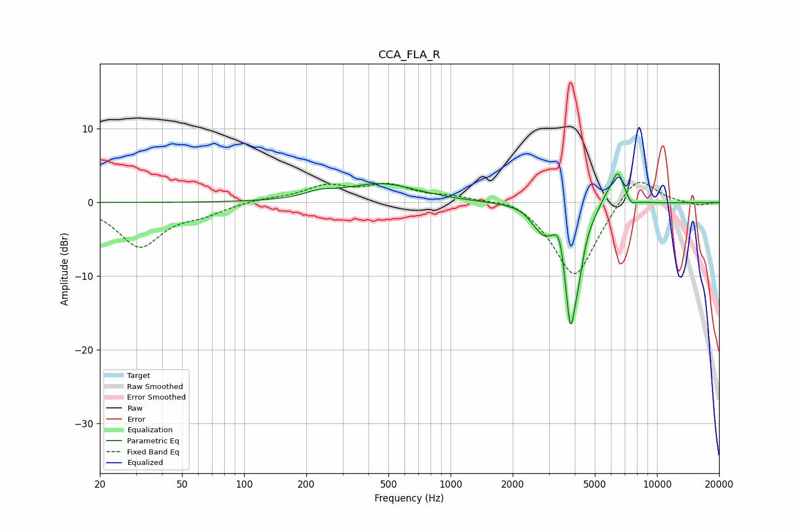

# CCA_FLA_R
See [usage instructions](https://github.com/jaakkopasanen/AutoEq#usage) for more options and info.

### Parametric EQs
Apply preamp of -4.0 dB when using parametric equalizer.

|   # | Type    |   Fc (Hz) |    Q |   Gain (dB) |
|-----|---------|-----------|------|-------------|
|   1 | Peaking |       232 | 2.01 |         0.8 |
|   2 | Peaking |       461 | 0.81 |         2.5 |
|   3 | Peaking |      2536 | 4.64 |        -0.7 |
|   4 | Peaking |      2835 | 3.55 |        -2.2 |
|   5 | Peaking |      3374 | 5.99 |         2.9 |
|   6 | Peaking |      3812 | 4.48 |       -16.1 |
|   7 | Peaking |      4177 | 6    |        -2.9 |
|   8 | Peaking |      5715 | 3.51 |         1.3 |
|   9 | Peaking |      6473 | 4.48 |         4.3 |
|  10 | Peaking |      7520 | 5.96 |        -0.8 |

### Fixed Band EQs
When using fixed band (also called graphic) equalizer, apply preamp of **-2.8 dB** (if available) and set gains manually with these parameters.

|   # | Type    |   Fc (Hz) |    Q |   Gain (dB) |
|-----|---------|-----------|------|-------------|
|   1 | Peaking |        31 | 1.41 |        -5.9 |
|   2 | Peaking |        62 | 1.41 |        -1.2 |
|   3 | Peaking |       125 | 1.41 |         0.5 |
|   4 | Peaking |       250 | 1.41 |         2.1 |
|   5 | Peaking |       500 | 1.41 |         2.1 |
|   6 | Peaking |      1000 | 1.41 |         0.8 |
|   7 | Peaking |      2000 | 1.41 |         1.1 |
|   8 | Peaking |      4000 | 1.41 |       -10.5 |
|   9 | Peaking |      8000 | 1.41 |         4.3 |
|  10 | Peaking |     16000 | 1.41 |        -0.4 |

### Graphs

