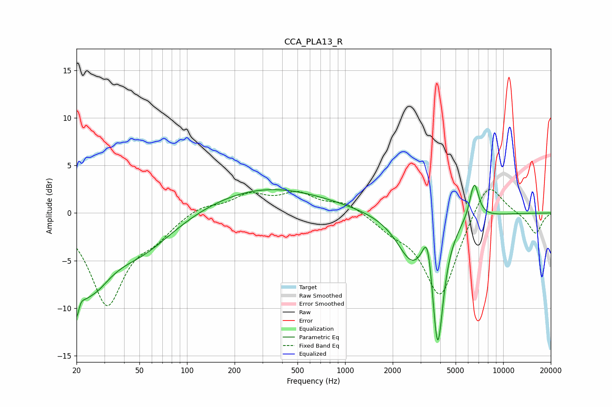

# CCA_PLA13_R
See [usage instructions](https://github.com/jaakkopasanen/AutoEq#usage) for more options and info.

### Parametric EQs
Apply preamp of -3.0 dB when using parametric equalizer.

|   # | Type    |   Fc (Hz) |    Q |   Gain (dB) |
|-----|---------|-----------|------|-------------|
|   1 | Peaking |        20 | 3.83 |        -8.4 |
|   2 | Peaking |        21 | 5.65 |         3.3 |
|   3 | Peaking |        25 | 1.18 |        -5.4 |
|   4 | Peaking |        51 | 0.67 |        -3.6 |
|   5 | Peaking |       318 | 0.37 |         2.7 |
|   6 | Peaking |      2647 | 1.49 |        -4.5 |
|   7 | Peaking |      3329 | 4.42 |         4.4 |
|   8 | Peaking |      3735 | 5.78 |        -0.9 |
|   9 | Peaking |      3860 | 3.82 |       -12.5 |
|  10 | Peaking |      6560 | 4.79 |         3.9 |

### Fixed Band EQs
When using fixed band (also called graphic) equalizer, apply preamp of **-2.6 dB** (if available) and set gains manually with these parameters.

|   # | Type    |   Fc (Hz) |    Q |   Gain (dB) |
|-----|---------|-----------|------|-------------|
|   1 | Peaking |        31 | 1.41 |        -9.4 |
|   2 | Peaking |        62 | 1.41 |        -1.9 |
|   3 | Peaking |       125 | 1.41 |         0.9 |
|   4 | Peaking |       250 | 1.41 |         1.8 |
|   5 | Peaking |       500 | 1.41 |         1.9 |
|   6 | Peaking |      1000 | 1.41 |         1.1 |
|   7 | Peaking |      2000 | 1.41 |        -1.3 |
|   8 | Peaking |      4000 | 1.41 |        -8.9 |
|   9 | Peaking |      8000 | 1.41 |         3.9 |
|  10 | Peaking |     16000 | 1.41 |        -2.2 |

### Graphs

