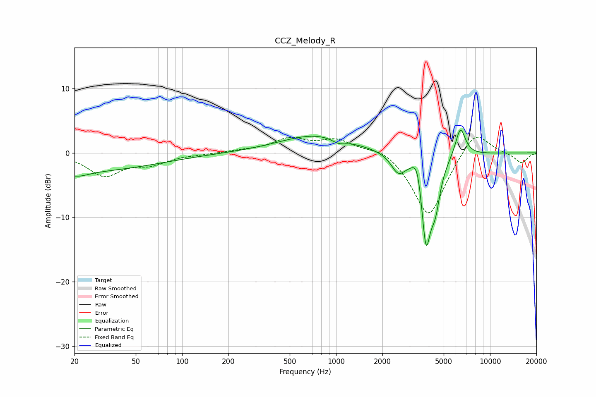

# CCZ_Melody_R
See [usage instructions](https://github.com/jaakkopasanen/AutoEq#usage) for more options and info.

### Parametric EQs
Apply preamp of -3.6 dB when using parametric equalizer.

|   # | Type    |   Fc (Hz) |    Q |   Gain (dB) |
|-----|---------|-----------|------|-------------|
|   1 | Peaking |        20 | 0.26 |        -2.9 |
|   2 | Peaking |        20 | 5.27 |         0.2 |
|   3 | Peaking |        20 | 2.11 |        -1   |
|   4 | Peaking |       745 | 0.6  |         2.8 |
|   5 | Peaking |      1039 | 3.21 |        -0.7 |
|   6 | Peaking |      2534 | 3.07 |        -2.7 |
|   7 | Peaking |      3385 | 4.15 |         4.4 |
|   8 | Peaking |      3834 | 3.94 |       -14.8 |
|   9 | Peaking |      4418 | 4.67 |        -4.8 |
|  10 | Peaking |      6418 | 4.21 |         4.6 |

### Fixed Band EQs
When using fixed band (also called graphic) equalizer, apply preamp of **-2.5 dB** (if available) and set gains manually with these parameters.

|   # | Type    |   Fc (Hz) |    Q |   Gain (dB) |
|-----|---------|-----------|------|-------------|
|   1 | Peaking |        31 | 1.41 |        -3.4 |
|   2 | Peaking |        62 | 1.41 |        -1.5 |
|   3 | Peaking |       125 | 1.41 |        -0.2 |
|   4 | Peaking |       250 | 1.41 |         0.3 |
|   5 | Peaking |       500 | 1.41 |         2.1 |
|   6 | Peaking |      1000 | 1.41 |         1.9 |
|   7 | Peaking |      2000 | 1.41 |         1.2 |
|   8 | Peaking |      4000 | 1.41 |       -10.2 |
|   9 | Peaking |      8000 | 1.41 |         4   |
|  10 | Peaking |     16000 | 1.41 |        -1.6 |

### Graphs

