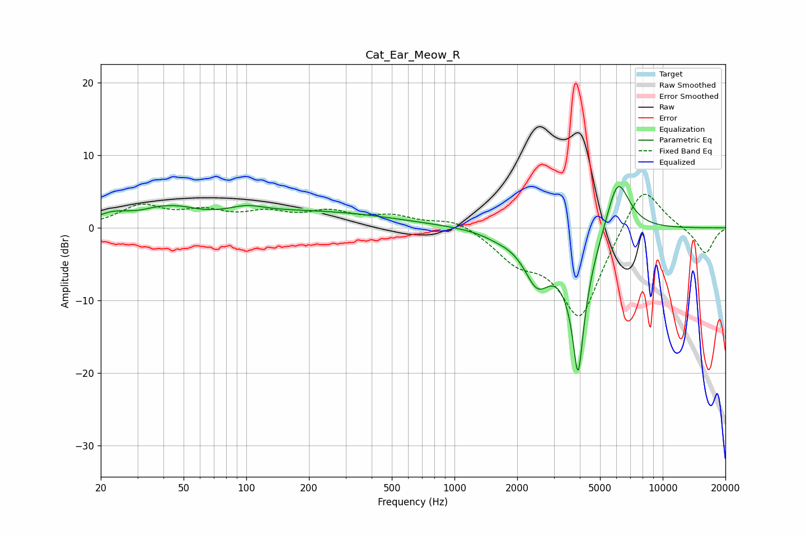

# Cat_Ear_Meow_R
See [usage instructions](https://github.com/jaakkopasanen/AutoEq#usage) for more options and info.

### Parametric EQs
Apply preamp of -5.8 dB when using parametric equalizer.

|   # | Type    |   Fc (Hz) |    Q |   Gain (dB) |
|-----|---------|-----------|------|-------------|
|   1 | Peaking |        23 | 1.68 |         1.4 |
|   2 | Peaking |        42 | 1.41 |         3.2 |
|   3 | Peaking |        42 | 2    |        -1.2 |
|   4 | Peaking |       100 | 1.69 |         1   |
|   5 | Peaking |       198 | 0.35 |         2.2 |
|   6 | Peaking |       368 | 1.48 |         0   |
|   7 | Peaking |      1613 | 1.96 |        -0.6 |
|   8 | Peaking |      2494 | 2.17 |        -6.3 |
|   9 | Peaking |      3923 | 3.79 |       -20   |
|  10 | Peaking |      6073 | 2.38 |         8.2 |

### Fixed Band EQs
When using fixed band (also called graphic) equalizer, apply preamp of **-4.7 dB** (if available) and set gains manually with these parameters.

|   # | Type    |   Fc (Hz) |    Q |   Gain (dB) |
|-----|---------|-----------|------|-------------|
|   1 | Peaking |        31 | 1.41 |         2.8 |
|   2 | Peaking |        62 | 1.41 |         1.9 |
|   3 | Peaking |       125 | 1.41 |         1.7 |
|   4 | Peaking |       250 | 1.41 |         1.9 |
|   5 | Peaking |       500 | 1.41 |         1.4 |
|   6 | Peaking |      1000 | 1.41 |         1.4 |
|   7 | Peaking |      2000 | 1.41 |        -3.5 |
|   8 | Peaking |      4000 | 1.41 |       -12.6 |
|   9 | Peaking |      8000 | 1.41 |         7   |
|  10 | Peaking |     16000 | 1.41 |        -3.7 |

### Graphs

