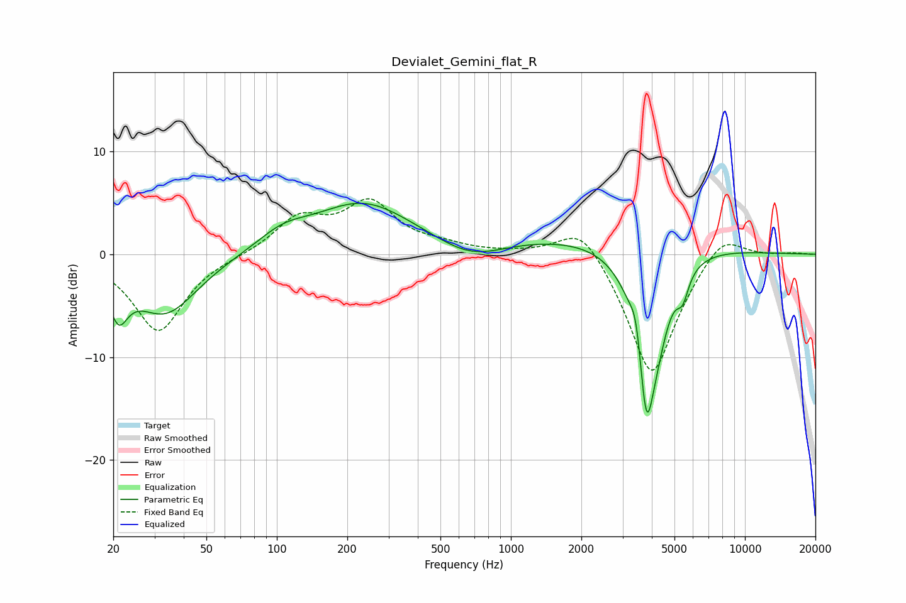

# Devialet_Gemini_flat_R
See [usage instructions](https://github.com/jaakkopasanen/AutoEq#usage) for more options and info.

### Parametric EQs
Apply preamp of -5.0 dB when using parametric equalizer.

|   # | Type    |   Fc (Hz) |    Q |   Gain (dB) |
|-----|---------|-----------|------|-------------|
|   1 | Peaking |        21 | 3.61 |        -4   |
|   2 | Peaking |        33 | 1.01 |        -5.8 |
|   3 | Peaking |       106 | 1.34 |         1.5 |
|   4 | Peaking |       233 | 0.66 |         4.9 |
|   5 | Peaking |       676 | 0.97 |        -1.9 |
|   6 | Peaking |      2215 | 0.29 |         1.8 |
|   7 | Peaking |      3436 | 6    |         3.1 |
|   8 | Peaking |      3794 | 3.11 |       -15.9 |
|   9 | Peaking |      4258 | 2.91 |        -3.1 |
|  10 | Peaking |      5416 | 5.35 |        -2.4 |

### Fixed Band EQs
When using fixed band (also called graphic) equalizer, apply preamp of **-5.5 dB** (if available) and set gains manually with these parameters.

|   # | Type    |   Fc (Hz) |    Q |   Gain (dB) |
|-----|---------|-----------|------|-------------|
|   1 | Peaking |        31 | 1.41 |        -7.5 |
|   2 | Peaking |        62 | 1.41 |        -0.1 |
|   3 | Peaking |       125 | 1.41 |         3.4 |
|   4 | Peaking |       250 | 1.41 |         4.7 |
|   5 | Peaking |       500 | 1.41 |         0.6 |
|   6 | Peaking |      1000 | 1.41 |         0.1 |
|   7 | Peaking |      2000 | 1.41 |         3.6 |
|   8 | Peaking |      4000 | 1.41 |       -12.3 |
|   9 | Peaking |      8000 | 1.41 |         2.7 |
|  10 | Peaking |     16000 | 1.41 |         0.1 |

### Graphs

