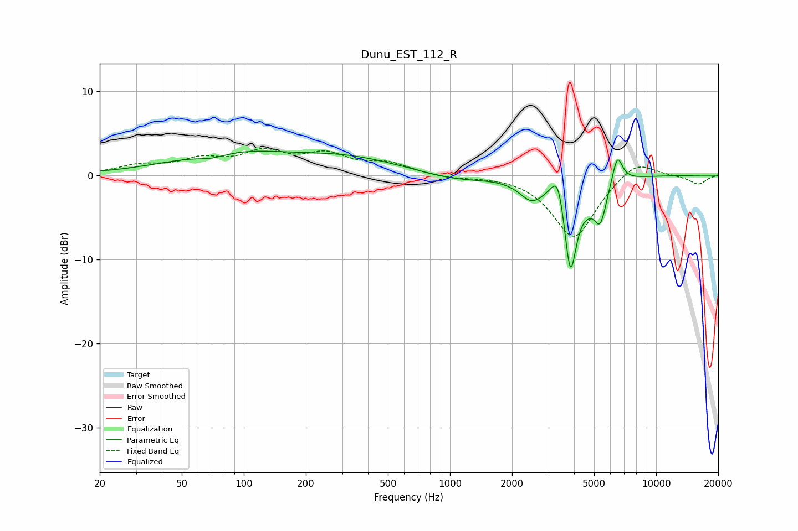

# Dunu_EST_112_R
See [usage instructions](https://github.com/jaakkopasanen/AutoEq#usage) for more options and info.

### Parametric EQs
Apply preamp of -2.9 dB when using parametric equalizer.

|   # | Type    |   Fc (Hz) |    Q |   Gain (dB) |
|-----|---------|-----------|------|-------------|
|   1 | Peaking |        70 | 1.88 |        -0.7 |
|   2 | Peaking |        85 | 0.51 |         2.5 |
|   3 | Peaking |       322 | 0.53 |         1.9 |
|   4 | Peaking |      1061 | 0.84 |        -0.8 |
|   5 | Peaking |      2493 | 2.33 |        -2.5 |
|   6 | Peaking |      3342 | 4.65 |         3.7 |
|   7 | Peaking |      3838 | 4.47 |       -11.1 |
|   8 | Peaking |      4636 | 3.89 |        -1.1 |
|   9 | Peaking |      5358 | 4.44 |        -4.6 |
|  10 | Peaking |      6486 | 5.55 |         3.4 |

### Fixed Band EQs
When using fixed band (also called graphic) equalizer, apply preamp of **-3.3 dB** (if available) and set gains manually with these parameters.

|   # | Type    |   Fc (Hz) |    Q |   Gain (dB) |
|-----|---------|-----------|------|-------------|
|   1 | Peaking |        31 | 1.41 |         1   |
|   2 | Peaking |        62 | 1.41 |         1.6 |
|   3 | Peaking |       125 | 1.41 |         2.4 |
|   4 | Peaking |       250 | 1.41 |         2.2 |
|   5 | Peaking |       500 | 1.41 |         1.3 |
|   6 | Peaking |      1000 | 1.41 |        -0.3 |
|   7 | Peaking |      2000 | 1.41 |         0.1 |
|   8 | Peaking |      4000 | 1.41 |        -7.6 |
|   9 | Peaking |      8000 | 1.41 |         2.1 |
|  10 | Peaking |     16000 | 1.41 |        -1.1 |

### Graphs

