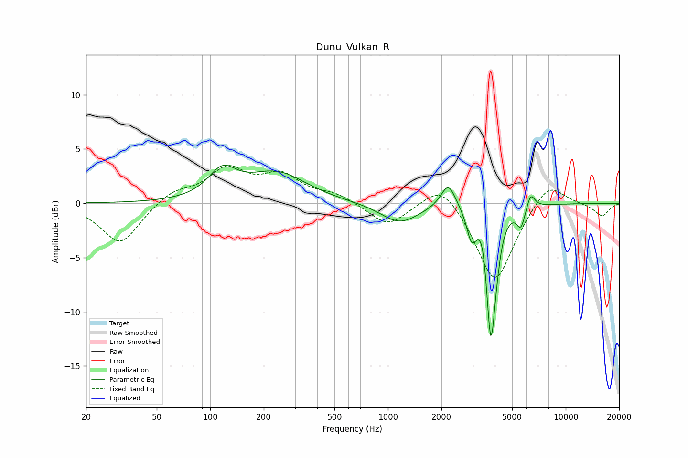

# Dunu_Vulkan_R
See [usage instructions](https://github.com/jaakkopasanen/AutoEq#usage) for more options and info.

### Parametric EQs
Apply preamp of -3.6 dB when using parametric equalizer.

|   # | Type    |   Fc (Hz) |    Q |   Gain (dB) |
|-----|---------|-----------|------|-------------|
|   1 | Peaking |       117 | 1.81 |         2.5 |
|   2 | Peaking |       237 | 0.85 |         2.7 |
|   3 | Peaking |      1163 | 1.34 |        -1.8 |
|   4 | Peaking |      2186 | 3.41 |         2.4 |
|   5 | Peaking |      2955 | 5.27 |        -2.6 |
|   6 | Peaking |      3414 | 5.98 |         1.5 |
|   7 | Peaking |      3788 | 5.47 |       -11.8 |
|   8 | Peaking |      4054 | 6    |        -1.3 |
|   9 | Peaking |      5601 | 6    |        -1.8 |
|  10 | Peaking |      6356 | 5.97 |         1.4 |

### Fixed Band EQs
When using fixed band (also called graphic) equalizer, apply preamp of **-3.6 dB** (if available) and set gains manually with these parameters.

|   # | Type    |   Fc (Hz) |    Q |   Gain (dB) |
|-----|---------|-----------|------|-------------|
|   1 | Peaking |        31 | 1.41 |        -3.8 |
|   2 | Peaking |        62 | 1.41 |         1.1 |
|   3 | Peaking |       125 | 1.41 |         3   |
|   4 | Peaking |       250 | 1.41 |         2.3 |
|   5 | Peaking |       500 | 1.41 |         0.8 |
|   6 | Peaking |      1000 | 1.41 |        -2.1 |
|   7 | Peaking |      2000 | 1.41 |         2.3 |
|   8 | Peaking |      4000 | 1.41 |        -7.5 |
|   9 | Peaking |      8000 | 1.41 |         2.3 |
|  10 | Peaking |     16000 | 1.41 |        -1.2 |

### Graphs

