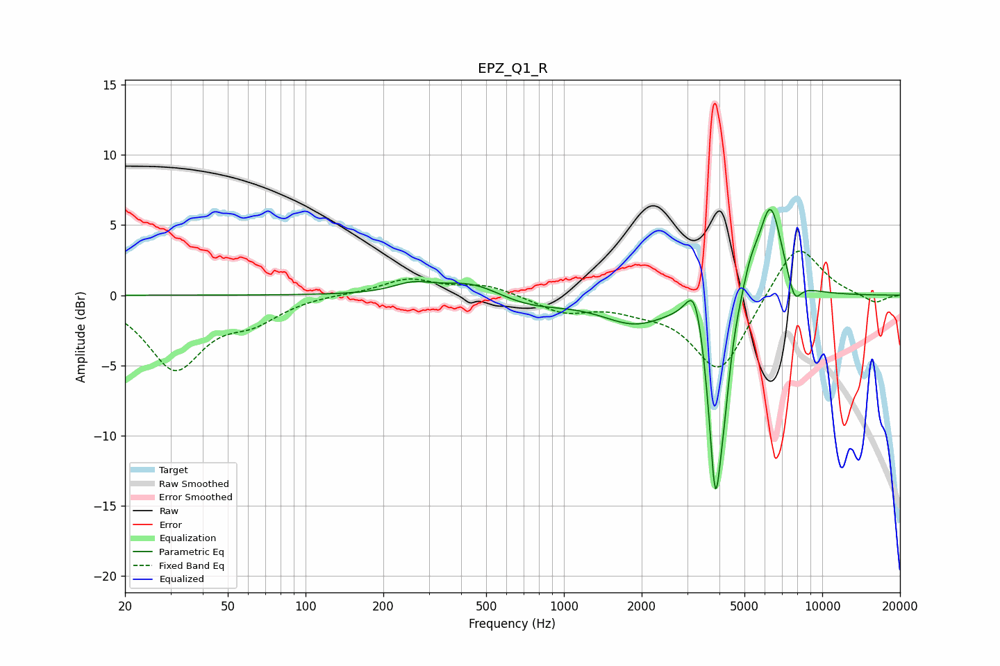

# EPZ_Q1_R
See [usage instructions](https://github.com/jaakkopasanen/AutoEq#usage) for more options and info.

### Parametric EQs
Apply preamp of -6.2 dB when using parametric equalizer.

|   # | Type    |   Fc (Hz) |    Q |   Gain (dB) |
|-----|---------|-----------|------|-------------|
|   1 | Peaking |       259 | 1.87 |         0.7 |
|   2 | Peaking |       441 | 1.19 |         1.1 |
|   3 | Peaking |       726 | 0.98 |        -0.8 |
|   4 | Peaking |      1885 | 1.09 |        -1.9 |
|   5 | Peaking |      3213 | 4.17 |         3.1 |
|   6 | Peaking |      3857 | 5.21 |       -13.6 |
|   7 | Peaking |      4178 | 6    |        -3   |
|   8 | Peaking |      5286 | 4.28 |         1.6 |
|   9 | Peaking |      6306 | 2.93 |         6.6 |
|  10 | Peaking |      7804 | 5.07 |        -1.8 |

### Fixed Band EQs
When using fixed band (also called graphic) equalizer, apply preamp of **-3.2 dB** (if available) and set gains manually with these parameters.

|   # | Type    |   Fc (Hz) |    Q |   Gain (dB) |
|-----|---------|-----------|------|-------------|
|   1 | Peaking |        31 | 1.41 |        -5.1 |
|   2 | Peaking |        62 | 1.41 |        -1.5 |
|   3 | Peaking |       125 | 1.41 |         0.1 |
|   4 | Peaking |       250 | 1.41 |         1.1 |
|   5 | Peaking |       500 | 1.41 |         0.7 |
|   6 | Peaking |      1000 | 1.41 |        -1.1 |
|   7 | Peaking |      2000 | 1.41 |        -0.7 |
|   8 | Peaking |      4000 | 1.41 |        -5.5 |
|   9 | Peaking |      8000 | 1.41 |         4   |
|  10 | Peaking |     16000 | 1.41 |        -0.6 |

### Graphs

