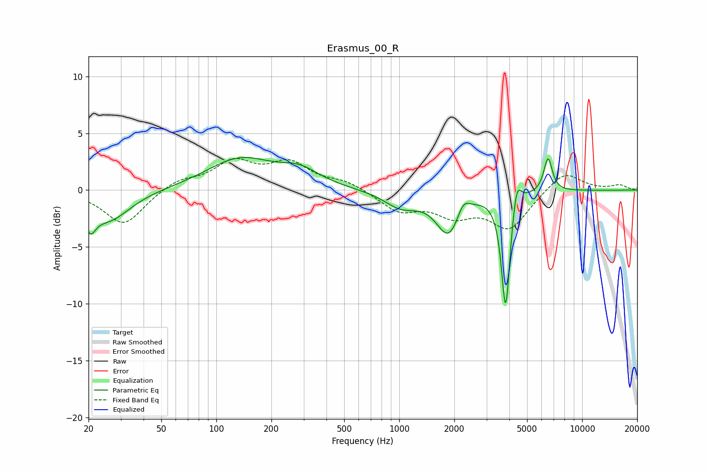

# Erasmus_00_R
See [usage instructions](https://github.com/jaakkopasanen/AutoEq#usage) for more options and info.

### Parametric EQs
Apply preamp of -3.0 dB when using parametric equalizer.

|   # | Type    |   Fc (Hz) |    Q |   Gain (dB) |
|-----|---------|-----------|------|-------------|
|   1 | Peaking |        20 | 4.92 |        -1.9 |
|   2 | Peaking |        26 | 1.19 |        -2.7 |
|   3 | Peaking |       134 | 0.78 |         2.7 |
|   4 | Peaking |       286 | 1.28 |         1.3 |
|   5 | Peaking |      1024 | 1.52 |        -1.4 |
|   6 | Peaking |      1871 | 2.08 |        -3.8 |
|   7 | Peaking |      2232 | 4.09 |         1.4 |
|   8 | Peaking |      3820 | 6    |       -10.4 |
|   9 | Peaking |      4384 | 6    |         2.5 |
|  10 | Peaking |      6511 | 6    |         3   |

### Fixed Band EQs
When using fixed band (also called graphic) equalizer, apply preamp of **-2.9 dB** (if available) and set gains manually with these parameters.

|   # | Type    |   Fc (Hz) |    Q |   Gain (dB) |
|-----|---------|-----------|------|-------------|
|   1 | Peaking |        31 | 1.41 |        -3.1 |
|   2 | Peaking |        62 | 1.41 |         0.9 |
|   3 | Peaking |       125 | 1.41 |         2.3 |
|   4 | Peaking |       250 | 1.41 |         2.2 |
|   5 | Peaking |       500 | 1.41 |         0.7 |
|   6 | Peaking |      1000 | 1.41 |        -1.7 |
|   7 | Peaking |      2000 | 1.41 |        -1.9 |
|   8 | Peaking |      4000 | 1.41 |        -3.3 |
|   9 | Peaking |      8000 | 1.41 |         1.8 |
|  10 | Peaking |     16000 | 1.41 |         0.4 |

### Graphs

