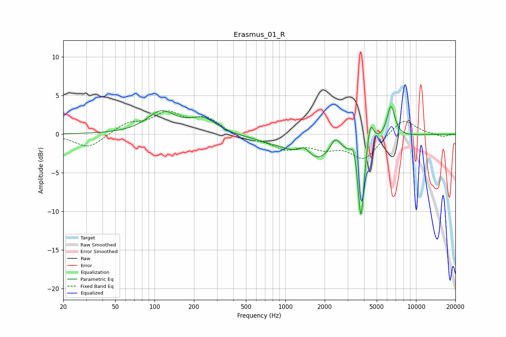

# Erasmus_01_R
See [usage instructions](https://github.com/jaakkopasanen/AutoEq#usage) for more options and info.

### Parametric EQs
Apply preamp of -3.7 dB when using parametric equalizer.

|   # | Type    |   Fc (Hz) |    Q |   Gain (dB) |
|-----|---------|-----------|------|-------------|
|   1 | Peaking |       113 | 1.31 |         2.8 |
|   2 | Peaking |       235 | 1.42 |         1.8 |
|   3 | Peaking |      1398 | 3.52 |         1.1 |
|   4 | Peaking |      1745 | 0.54 |        -2.7 |
|   5 | Peaking |      1787 | 1.62 |        -0.8 |
|   6 | Peaking |      2417 | 3.42 |         2.2 |
|   7 | Peaking |      3356 | 6    |         1.9 |
|   8 | Peaking |      3789 | 6    |       -10.6 |
|   9 | Peaking |      4463 | 5.51 |         3.5 |
|  10 | Peaking |      6426 | 4.5  |         4.2 |

### Fixed Band EQs
When using fixed band (also called graphic) equalizer, apply preamp of **-3.1 dB** (if available) and set gains manually with these parameters.

|   # | Type    |   Fc (Hz) |    Q |   Gain (dB) |
|-----|---------|-----------|------|-------------|
|   1 | Peaking |        31 | 1.41 |        -1.9 |
|   2 | Peaking |        62 | 1.41 |         1.3 |
|   3 | Peaking |       125 | 1.41 |         2.5 |
|   4 | Peaking |       250 | 1.41 |         1.9 |
|   5 | Peaking |       500 | 1.41 |        -0.7 |
|   6 | Peaking |      1000 | 1.41 |        -1.7 |
|   7 | Peaking |      2000 | 1.41 |        -1.4 |
|   8 | Peaking |      4000 | 1.41 |        -3.1 |
|   9 | Peaking |      8000 | 1.41 |         2.2 |
|  10 | Peaking |     16000 | 1.41 |        -0.4 |

### Graphs

