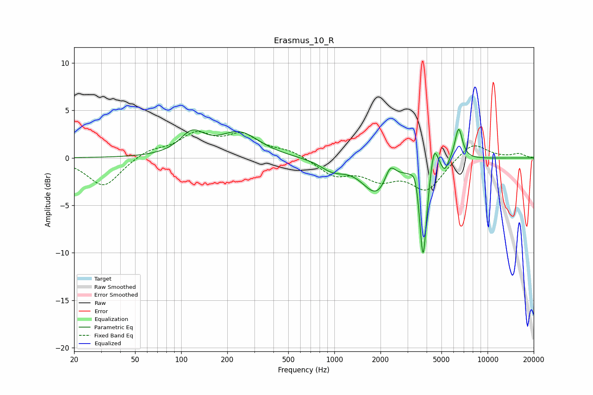

# Erasmus_10_R
See [usage instructions](https://github.com/jaakkopasanen/AutoEq#usage) for more options and info.

### Parametric EQs
Apply preamp of -3.1 dB when using parametric equalizer.

|   # | Type    |   Fc (Hz) |    Q |   Gain (dB) |
|-----|---------|-----------|------|-------------|
|   1 | Peaking |       118 | 1.79 |         2.3 |
|   2 | Peaking |       240 | 1.1  |         2.5 |
|   3 | Peaking |       974 | 1.77 |        -1.1 |
|   4 | Peaking |      1902 | 1.49 |        -3.7 |
|   5 | Peaking |      2308 | 4.16 |         1.9 |
|   6 | Peaking |      3386 | 6    |         1.4 |
|   7 | Peaking |      3793 | 6    |       -10.6 |
|   8 | Peaking |      4469 | 5.97 |         2.9 |
|   9 | Peaking |      5255 | 6    |        -1.2 |
|  10 | Peaking |      6474 | 5.65 |         3.4 |

### Fixed Band EQs
When using fixed band (also called graphic) equalizer, apply preamp of **-2.9 dB** (if available) and set gains manually with these parameters.

|   # | Type    |   Fc (Hz) |    Q |   Gain (dB) |
|-----|---------|-----------|------|-------------|
|   1 | Peaking |        31 | 1.41 |        -3.1 |
|   2 | Peaking |        62 | 1.41 |         0.8 |
|   3 | Peaking |       125 | 1.41 |         2.3 |
|   4 | Peaking |       250 | 1.41 |         2.2 |
|   5 | Peaking |       500 | 1.41 |         0.7 |
|   6 | Peaking |      1000 | 1.41 |        -1.7 |
|   7 | Peaking |      2000 | 1.41 |        -1.9 |
|   8 | Peaking |      4000 | 1.41 |        -3.2 |
|   9 | Peaking |      8000 | 1.41 |         1.8 |
|  10 | Peaking |     16000 | 1.41 |         0.4 |

### Graphs

