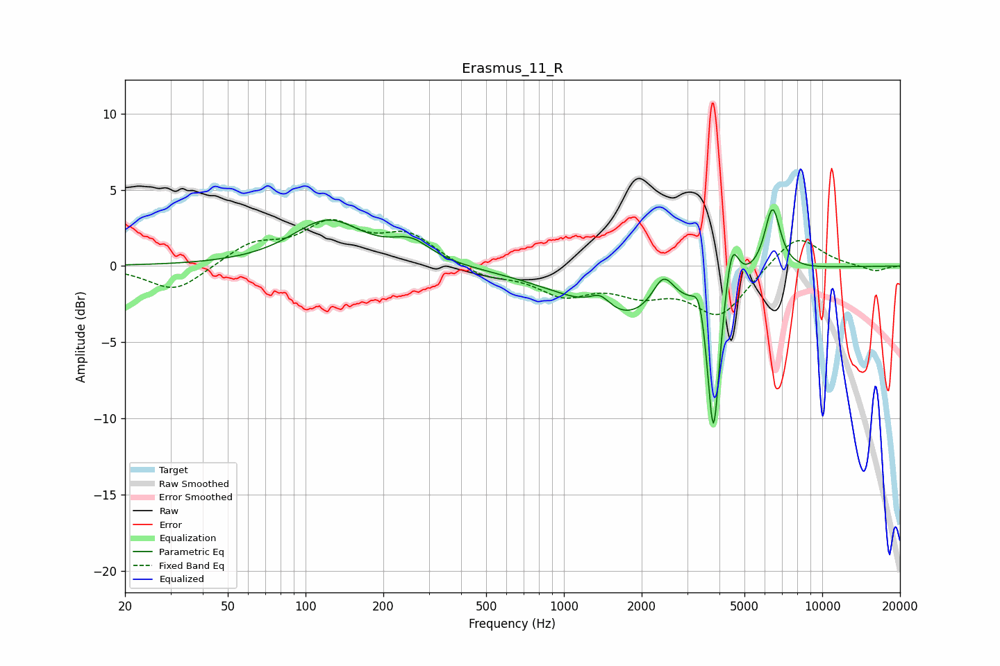

# Erasmus_11_R
See [usage instructions](https://github.com/jaakkopasanen/AutoEq#usage) for more options and info.

### Parametric EQs
Apply preamp of -3.8 dB when using parametric equalizer.

|   # | Type    |   Fc (Hz) |    Q |   Gain (dB) |
|-----|---------|-----------|------|-------------|
|   1 | Peaking |       122 | 1.03 |         2.9 |
|   2 | Peaking |       256 | 1.87 |         1.3 |
|   3 | Peaking |      1381 | 3.49 |         1   |
|   4 | Peaking |      1731 | 0.59 |        -2.8 |
|   5 | Peaking |      1759 | 1.37 |        -0.6 |
|   6 | Peaking |      2425 | 3.42 |         2   |
|   7 | Peaking |      3345 | 6    |         1.7 |
|   8 | Peaking |      3794 | 6    |       -10.5 |
|   9 | Peaking |      4460 | 5.47 |         3.3 |
|  10 | Peaking |      6420 | 4.42 |         4.3 |

### Fixed Band EQs
When using fixed band (also called graphic) equalizer, apply preamp of **-3.1 dB** (if available) and set gains manually with these parameters.

|   # | Type    |   Fc (Hz) |    Q |   Gain (dB) |
|-----|---------|-----------|------|-------------|
|   1 | Peaking |        31 | 1.41 |        -1.7 |
|   2 | Peaking |        62 | 1.41 |         1.4 |
|   3 | Peaking |       125 | 1.41 |         2.6 |
|   4 | Peaking |       250 | 1.41 |         1.9 |
|   5 | Peaking |       500 | 1.41 |        -0.7 |
|   6 | Peaking |      1000 | 1.41 |        -1.7 |
|   7 | Peaking |      2000 | 1.41 |        -1.5 |
|   8 | Peaking |      4000 | 1.41 |        -3.2 |
|   9 | Peaking |      8000 | 1.41 |         2.2 |
|  10 | Peaking |     16000 | 1.41 |        -0.4 |

### Graphs

