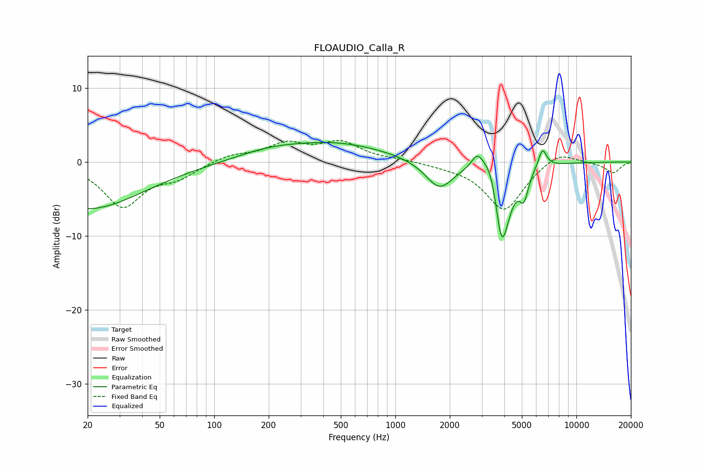

# FLOAUDIO_Calla_R
See [usage instructions](https://github.com/jaakkopasanen/AutoEq#usage) for more options and info.

### Parametric EQs
Apply preamp of -2.7 dB when using parametric equalizer.

|   # | Type    |   Fc (Hz) |    Q |   Gain (dB) |
|-----|---------|-----------|------|-------------|
|   1 | Peaking |        20 | 0.46 |        -6.4 |
|   2 | Peaking |       196 | 0.78 |         1   |
|   3 | Peaking |       469 | 0.49 |         2.5 |
|   4 | Peaking |      1752 | 1.84 |        -3.8 |
|   5 | Peaking |      2825 | 4.59 |         1.8 |
|   6 | Peaking |      3397 | 2.51 |         4.1 |
|   7 | Peaking |      3811 | 5.93 |        -2.3 |
|   8 | Peaking |      3916 | 2.86 |       -10.5 |
|   9 | Peaking |      5132 | 5.75 |        -3.3 |
|  10 | Peaking |      6496 | 5.9  |         2.6 |

### Fixed Band EQs
When using fixed band (also called graphic) equalizer, apply preamp of **-3.0 dB** (if available) and set gains manually with these parameters.

|   # | Type    |   Fc (Hz) |    Q |   Gain (dB) |
|-----|---------|-----------|------|-------------|
|   1 | Peaking |        31 | 1.41 |        -5.9 |
|   2 | Peaking |        62 | 1.41 |        -1.8 |
|   3 | Peaking |       125 | 1.41 |         1   |
|   4 | Peaking |       250 | 1.41 |         2.3 |
|   5 | Peaking |       500 | 1.41 |         2.5 |
|   6 | Peaking |      1000 | 1.41 |         0.3 |
|   7 | Peaking |      2000 | 1.41 |        -0.4 |
|   8 | Peaking |      4000 | 1.41 |        -6.6 |
|   9 | Peaking |      8000 | 1.41 |         1.7 |
|  10 | Peaking |     16000 | 1.41 |        -1.5 |

### Graphs

