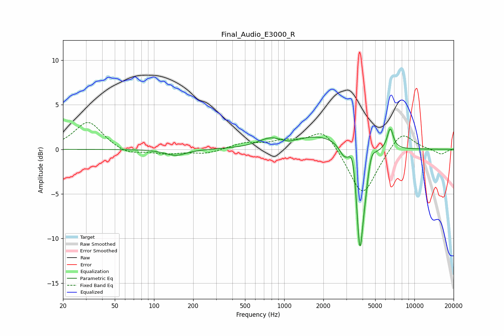

# Final_Audio_E3000_R
See [usage instructions](https://github.com/jaakkopasanen/AutoEq#usage) for more options and info.

### Parametric EQs
Apply preamp of -2.4 dB when using parametric equalizer.

|   # | Type    |   Fc (Hz) |    Q |   Gain (dB) |
|-----|---------|-----------|------|-------------|
|   1 | Peaking |       147 | 1.78 |        -0.7 |
|   2 | Peaking |       777 | 1.61 |         0.9 |
|   3 | Peaking |      1084 | 2.87 |        -0.3 |
|   4 | Peaking |      1928 | 0.68 |         1.5 |
|   5 | Peaking |      2870 | 3.98 |        -1.1 |
|   6 | Peaking |      3368 | 6    |         2   |
|   7 | Peaking |      3812 | 5.44 |       -11.5 |
|   8 | Peaking |      4176 | 6    |        -1.8 |
|   9 | Peaking |      4687 | 6    |         1   |
|  10 | Peaking |      6526 | 6    |         2.4 |

### Fixed Band EQs
When using fixed band (also called graphic) equalizer, apply preamp of **-3.1 dB** (if available) and set gains manually with these parameters.

|   # | Type    |   Fc (Hz) |    Q |   Gain (dB) |
|-----|---------|-----------|------|-------------|
|   1 | Peaking |        31 | 1.41 |         3.1 |
|   2 | Peaking |        62 | 1.41 |        -0.7 |
|   3 | Peaking |       125 | 1.41 |        -0.5 |
|   4 | Peaking |       250 | 1.41 |        -0.5 |
|   5 | Peaking |       500 | 1.41 |         0.7 |
|   6 | Peaking |      1000 | 1.41 |         0.8 |
|   7 | Peaking |      2000 | 1.41 |         2.4 |
|   8 | Peaking |      4000 | 1.41 |        -5.4 |
|   9 | Peaking |      8000 | 1.41 |         2.2 |
|  10 | Peaking |     16000 | 1.41 |        -0.6 |

### Graphs

