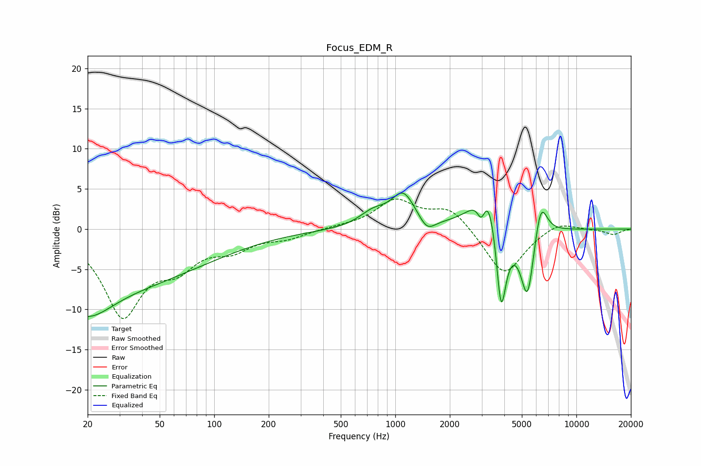

# Focus_EDM_R
See [usage instructions](https://github.com/jaakkopasanen/AutoEq#usage) for more options and info.

### Parametric EQs
Apply preamp of -4.6 dB when using parametric equalizer.

|   # | Type    |   Fc (Hz) |    Q |   Gain (dB) |
|-----|---------|-----------|------|-------------|
|   1 | Peaking |        20 | 1.08 |        -3.6 |
|   2 | Peaking |        20 | 0.2  |        -7.3 |
|   3 | Peaking |       754 | 1.83 |         1.7 |
|   4 | Peaking |      1107 | 2.16 |         4.1 |
|   5 | Peaking |      1497 | 3.29 |        -1.6 |
|   6 | Peaking |      2990 | 6    |        -3   |
|   7 | Peaking |      3269 | 2.02 |         8.6 |
|   8 | Peaking |      3836 | 4.27 |       -13.6 |
|   9 | Peaking |      5371 | 3.55 |        -9.3 |
|  10 | Peaking |      6344 | 3.81 |         5.1 |

### Fixed Band EQs
When using fixed band (also called graphic) equalizer, apply preamp of **-3.8 dB** (if available) and set gains manually with these parameters.

|   # | Type    |   Fc (Hz) |    Q |   Gain (dB) |
|-----|---------|-----------|------|-------------|
|   1 | Peaking |        31 | 1.41 |       -10.4 |
|   2 | Peaking |        62 | 1.41 |        -3.6 |
|   3 | Peaking |       125 | 1.41 |        -2.1 |
|   4 | Peaking |       250 | 1.41 |        -1   |
|   5 | Peaking |       500 | 1.41 |         0.2 |
|   6 | Peaking |      1000 | 1.41 |         3.5 |
|   7 | Peaking |      2000 | 1.41 |         2.7 |
|   8 | Peaking |      4000 | 1.41 |        -5.9 |
|   9 | Peaking |      8000 | 1.41 |         1.1 |
|  10 | Peaking |     16000 | 1.41 |        -0.7 |

### Graphs

