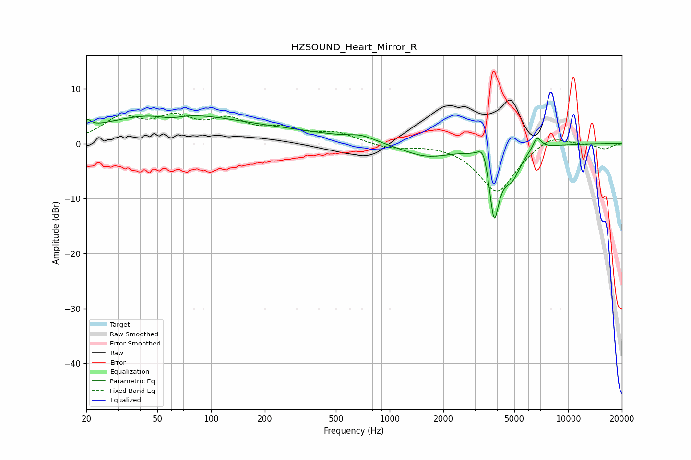

# HZSOUND_Heart_Mirror_R
See [usage instructions](https://github.com/jaakkopasanen/AutoEq#usage) for more options and info.

### Parametric EQs
Apply preamp of -5.1 dB when using parametric equalizer.

|   # | Type    |   Fc (Hz) |    Q |   Gain (dB) |
|-----|---------|-----------|------|-------------|
|   1 | Peaking |        20 | 5.88 |         1.6 |
|   2 | Peaking |        52 | 0.41 |         5   |
|   3 | Peaking |        59 | 1.94 |        -1   |
|   4 | Peaking |       227 | 0.37 |         1.9 |
|   5 | Peaking |       696 | 2.04 |         0.9 |
|   6 | Peaking |      1611 | 1.01 |        -2.4 |
|   7 | Peaking |      3368 | 4.4  |         4.2 |
|   8 | Peaking |      3844 | 4.55 |       -13.4 |
|   9 | Peaking |      4850 | 2.86 |        -4.6 |
|  10 | Peaking |      6696 | 5.84 |         2.3 |

### Fixed Band EQs
When using fixed band (also called graphic) equalizer, apply preamp of **-5.6 dB** (if available) and set gains manually with these parameters.

|   # | Type    |   Fc (Hz) |    Q |   Gain (dB) |
|-----|---------|-----------|------|-------------|
|   1 | Peaking |        31 | 1.41 |         4.3 |
|   2 | Peaking |        62 | 1.41 |         4   |
|   3 | Peaking |       125 | 1.41 |         3.6 |
|   4 | Peaking |       250 | 1.41 |         2.2 |
|   5 | Peaking |       500 | 1.41 |         1.8 |
|   6 | Peaking |      1000 | 1.41 |        -0.8 |
|   7 | Peaking |      2000 | 1.41 |         0.2 |
|   8 | Peaking |      4000 | 1.41 |        -8.9 |
|   9 | Peaking |      8000 | 1.41 |         2   |
|  10 | Peaking |     16000 | 1.41 |        -1   |

### Graphs

