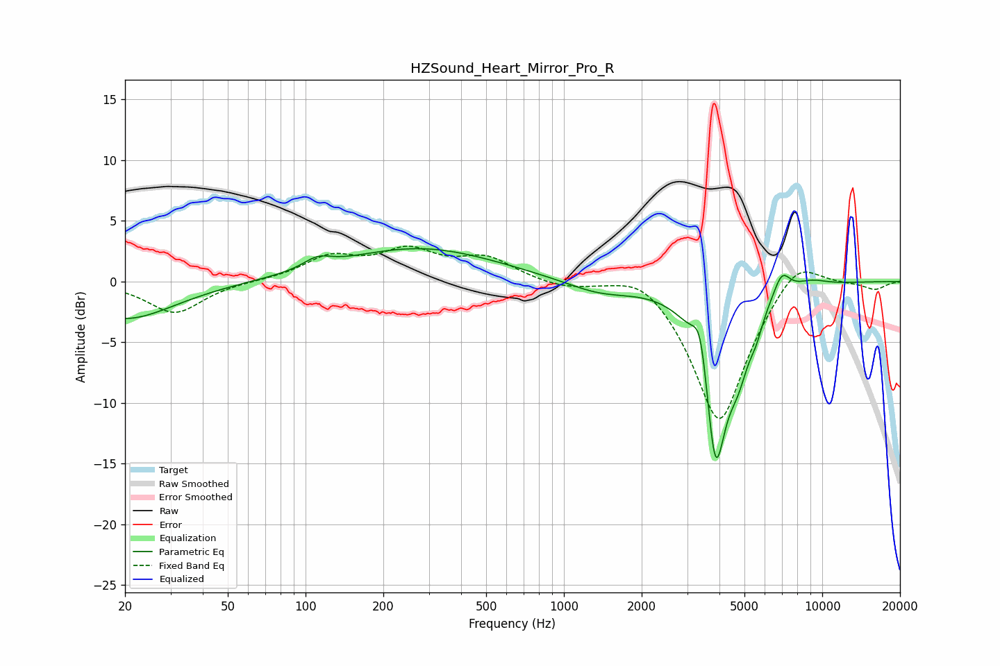

# HZSound_Heart_Mirror_Pro_R
See [usage instructions](https://github.com/jaakkopasanen/AutoEq#usage) for more options and info.

### Parametric EQs
Apply preamp of -2.8 dB when using parametric equalizer.

|   # | Type    |   Fc (Hz) |    Q |   Gain (dB) |
|-----|---------|-----------|------|-------------|
|   1 | Peaking |        20 | 0.74 |        -3.1 |
|   2 | Peaking |       111 | 2.64 |         0.8 |
|   3 | Peaking |       277 | 0.47 |         2.7 |
|   4 | Peaking |      1376 | 1.05 |        -1   |
|   5 | Peaking |      3380 | 4.77 |         4.1 |
|   6 | Peaking |      3859 | 3    |       -14.5 |
|   7 | Peaking |      4736 | 3.15 |        -3.8 |
|   8 | Peaking |      5546 | 5.06 |        -1.4 |
|   9 | Peaking |      6976 | 4.2  |         1.9 |
|  10 | Peaking |      9076 | 2.23 |         0.5 |

### Fixed Band EQs
When using fixed band (also called graphic) equalizer, apply preamp of **-3.0 dB** (if available) and set gains manually with these parameters.

|   # | Type    |   Fc (Hz) |    Q |   Gain (dB) |
|-----|---------|-----------|------|-------------|
|   1 | Peaking |        31 | 1.41 |        -2.6 |
|   2 | Peaking |        62 | 1.41 |         0   |
|   3 | Peaking |       125 | 1.41 |         1.9 |
|   4 | Peaking |       250 | 1.41 |         2.3 |
|   5 | Peaking |       500 | 1.41 |         1.8 |
|   6 | Peaking |      1000 | 1.41 |        -0.5 |
|   7 | Peaking |      2000 | 1.41 |         1.5 |
|   8 | Peaking |      4000 | 1.41 |       -11.9 |
|   9 | Peaking |      8000 | 1.41 |         2.6 |
|  10 | Peaking |     16000 | 1.41 |        -0.6 |

### Graphs

