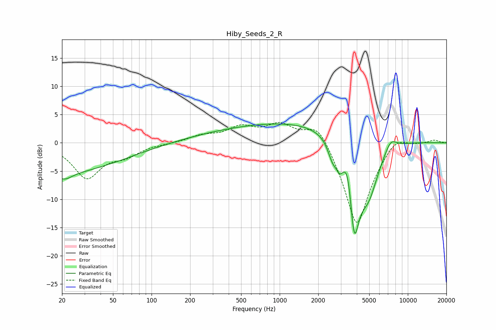

# Hiby_Seeds_2_R
See [usage instructions](https://github.com/jaakkopasanen/AutoEq#usage) for more options and info.

### Parametric EQs
Apply preamp of -3.4 dB when using parametric equalizer.

|   # | Type    |   Fc (Hz) |    Q |   Gain (dB) |
|-----|---------|-----------|------|-------------|
|   1 | Peaking |        20 | 0.3  |        -5.2 |
|   2 | Peaking |        21 | 2.46 |        -1.3 |
|   3 | Peaking |       474 | 0.38 |         2   |
|   4 | Peaking |      2201 | 0.34 |         3.1 |
|   5 | Peaking |      2582 | 4.02 |        -2.7 |
|   6 | Peaking |      2939 | 5.24 |        -2.4 |
|   7 | Peaking |      3415 | 4.09 |         4.6 |
|   8 | Peaking |      3814 | 2.98 |       -16.5 |
|   9 | Peaking |      4951 | 1.71 |        -8.2 |
|  10 | Peaking |      7345 | 2.97 |         2   |

### Fixed Band EQs
When using fixed band (also called graphic) equalizer, apply preamp of **-3.7 dB** (if available) and set gains manually with these parameters.

|   # | Type    |   Fc (Hz) |    Q |   Gain (dB) |
|-----|---------|-----------|------|-------------|
|   1 | Peaking |        31 | 1.41 |        -6   |
|   2 | Peaking |        62 | 1.41 |        -1.9 |
|   3 | Peaking |       125 | 1.41 |        -0.1 |
|   4 | Peaking |       250 | 1.41 |         1.1 |
|   5 | Peaking |       500 | 1.41 |         2.5 |
|   6 | Peaking |      1000 | 1.41 |         3   |
|   7 | Peaking |      2000 | 1.41 |         4.4 |
|   8 | Peaking |      4000 | 1.41 |       -15.3 |
|   9 | Peaking |      8000 | 1.41 |         2.3 |
|  10 | Peaking |     16000 | 1.41 |         0.6 |

### Graphs

