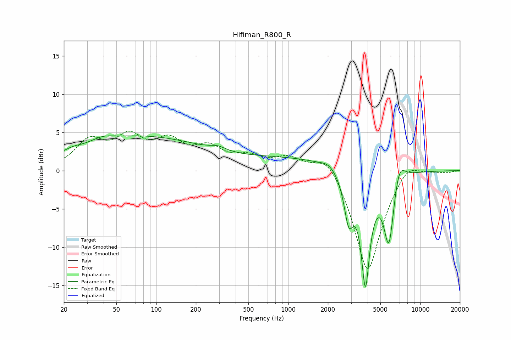

# Hifiman_R800_R
See [usage instructions](https://github.com/jaakkopasanen/AutoEq#usage) for more options and info.

### Parametric EQs
Apply preamp of -4.6 dB when using parametric equalizer.

|   # | Type    |   Fc (Hz) |    Q |   Gain (dB) |
|-----|---------|-----------|------|-------------|
|   1 | Peaking |        23 | 2.8  |         0.3 |
|   2 | Peaking |        39 | 1.91 |         0.5 |
|   3 | Peaking |        73 | 0.27 |         4.4 |
|   4 | Peaking |       293 | 2.5  |         0.5 |
|   5 | Peaking |      1099 | 0.36 |         1.5 |
|   6 | Peaking |      2031 | 2.65 |         0.7 |
|   7 | Peaking |      2877 | 3.95 |        -5.7 |
|   8 | Peaking |      3848 | 4.01 |       -14.3 |
|   9 | Peaking |      5800 | 3.48 |        -9.4 |
|  10 | Peaking |      6913 | 3.12 |         3.1 |

### Fixed Band EQs
When using fixed band (also called graphic) equalizer, apply preamp of **-5.3 dB** (if available) and set gains manually with these parameters.

|   # | Type    |   Fc (Hz) |    Q |   Gain (dB) |
|-----|---------|-----------|------|-------------|
|   1 | Peaking |        31 | 1.41 |         3.6 |
|   2 | Peaking |        62 | 1.41 |         3.8 |
|   3 | Peaking |       125 | 1.41 |         3.3 |
|   4 | Peaking |       250 | 1.41 |         2.5 |
|   5 | Peaking |       500 | 1.41 |         1.5 |
|   6 | Peaking |      1000 | 1.41 |         1.7 |
|   7 | Peaking |      2000 | 1.41 |         2.8 |
|   8 | Peaking |      4000 | 1.41 |       -13.6 |
|   9 | Peaking |      8000 | 1.41 |         2   |
|  10 | Peaking |     16000 | 1.41 |        -0.2 |

### Graphs

