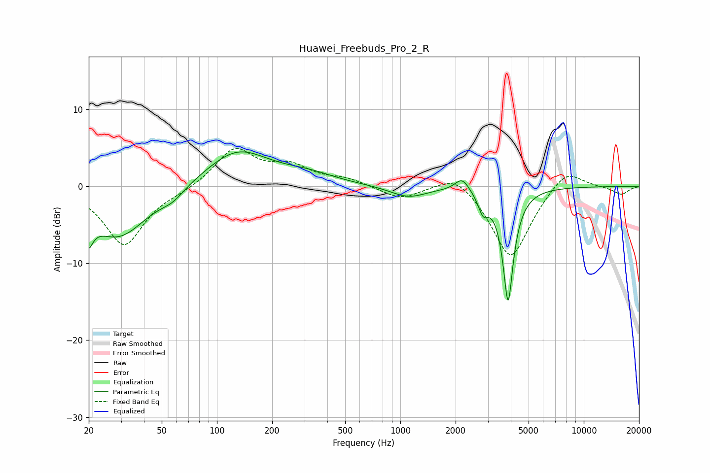

# Huawei_Freebuds_Pro_2_R
See [usage instructions](https://github.com/jaakkopasanen/AutoEq#usage) for more options and info.

### Parametric EQs
Apply preamp of -4.6 dB when using parametric equalizer.

|   # | Type    |   Fc (Hz) |    Q |   Gain (dB) |
|-----|---------|-----------|------|-------------|
|   1 | Peaking |        20 | 5.61 |        -6.9 |
|   2 | Peaking |        20 | 5.9  |         3.3 |
|   3 | Peaking |        29 | 0.87 |        -6.6 |
|   4 | Peaking |        57 | 2.3  |        -1.1 |
|   5 | Peaking |       129 | 0.81 |         4.7 |
|   6 | Peaking |       314 | 0.95 |         1.1 |
|   7 | Peaking |      1103 | 1.44 |        -1.4 |
|   8 | Peaking |      2173 | 3.65 |         1.8 |
|   9 | Peaking |      2829 | 5.2  |        -2.4 |
|  10 | Peaking |      3867 | 4.78 |       -14.8 |

### Fixed Band EQs
When using fixed band (also called graphic) equalizer, apply preamp of **-5.0 dB** (if available) and set gains manually with these parameters.

|   # | Type    |   Fc (Hz) |    Q |   Gain (dB) |
|-----|---------|-----------|------|-------------|
|   1 | Peaking |        31 | 1.41 |        -7.7 |
|   2 | Peaking |        62 | 1.41 |        -0.5 |
|   3 | Peaking |       125 | 1.41 |         4.8 |
|   4 | Peaking |       250 | 1.41 |         2.3 |
|   5 | Peaking |       500 | 1.41 |         0.9 |
|   6 | Peaking |      1000 | 1.41 |        -1.7 |
|   7 | Peaking |      2000 | 1.41 |         2.2 |
|   8 | Peaking |      4000 | 1.41 |        -9.6 |
|   9 | Peaking |      8000 | 1.41 |         2.7 |
|  10 | Peaking |     16000 | 1.41 |        -1.1 |

### Graphs

