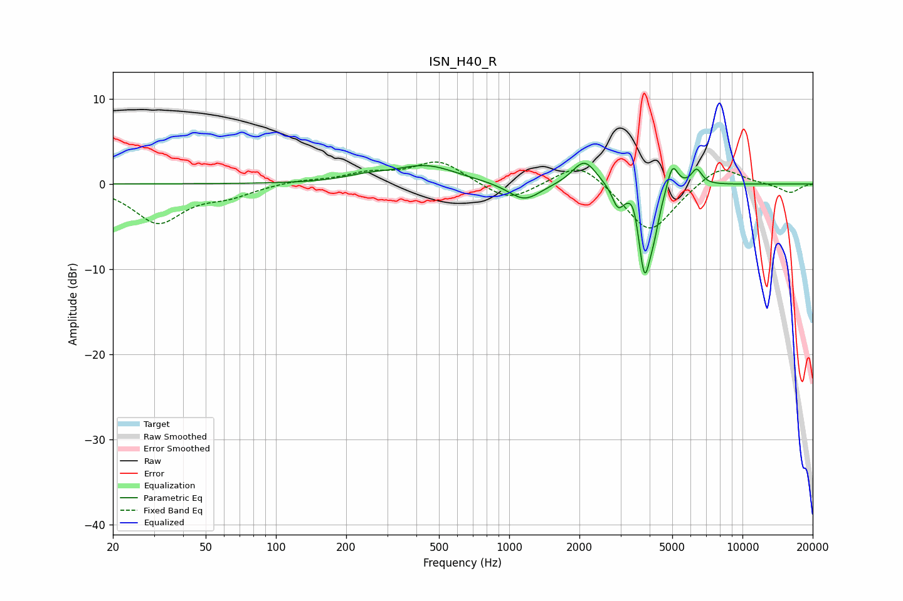

# ISN_H40_R
See [usage instructions](https://github.com/jaakkopasanen/AutoEq#usage) for more options and info.

### Parametric EQs
Apply preamp of -2.5 dB when using parametric equalizer.

|   # | Type    |   Fc (Hz) |    Q |   Gain (dB) |
|-----|---------|-----------|------|-------------|
|   1 | Peaking |       243 | 1.51 |         0.6 |
|   2 | Peaking |       439 | 1.06 |         2.1 |
|   3 | Peaking |      1163 | 2.03 |        -2.1 |
|   4 | Peaking |      2101 | 2.72 |         3   |
|   5 | Peaking |      2924 | 5.84 |        -2.3 |
|   6 | Peaking |      3421 | 6    |         2.1 |
|   7 | Peaking |      3800 | 4.86 |       -10.6 |
|   8 | Peaking |      4182 | 5.99 |        -2.4 |
|   9 | Peaking |      5009 | 5.87 |         3.2 |
|  10 | Peaking |      6360 | 6    |         1.9 |

### Fixed Band EQs
When using fixed band (also called graphic) equalizer, apply preamp of **-2.7 dB** (if available) and set gains manually with these parameters.

|   # | Type    |   Fc (Hz) |    Q |   Gain (dB) |
|-----|---------|-----------|------|-------------|
|   1 | Peaking |        31 | 1.41 |        -4.5 |
|   2 | Peaking |        62 | 1.41 |        -1.2 |
|   3 | Peaking |       125 | 1.41 |         0.4 |
|   4 | Peaking |       250 | 1.41 |         1.1 |
|   5 | Peaking |       500 | 1.41 |         2.7 |
|   6 | Peaking |      1000 | 1.41 |        -2.2 |
|   7 | Peaking |      2000 | 1.41 |         2.9 |
|   8 | Peaking |      4000 | 1.41 |        -6   |
|   9 | Peaking |      8000 | 1.41 |         2.4 |
|  10 | Peaking |     16000 | 1.41 |        -1.1 |

### Graphs

