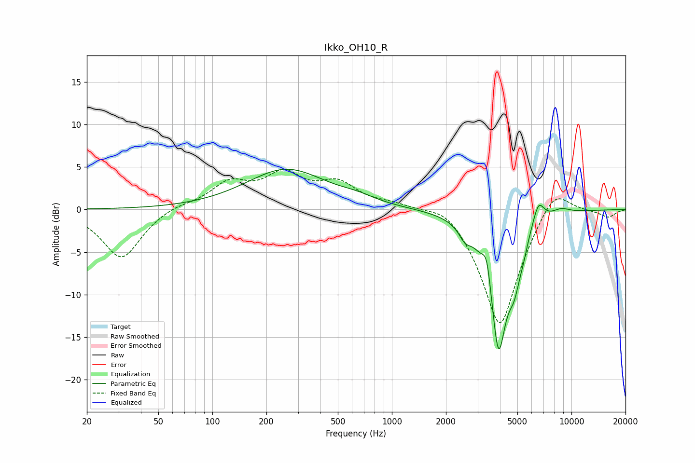

# Ikko_OH10_R
See [usage instructions](https://github.com/jaakkopasanen/AutoEq#usage) for more options and info.

### Parametric EQs
Apply preamp of -4.8 dB when using parametric equalizer.

|   # | Type    |   Fc (Hz) |    Q |   Gain (dB) |
|-----|---------|-----------|------|-------------|
|   1 | Peaking |       258 | 0.64 |         4.7 |
|   2 | Peaking |       642 | 1.48 |         0.6 |
|   3 | Peaking |      2055 | 1.12 |        -0   |
|   4 | Peaking |      2552 | 4.27 |        -1.3 |
|   5 | Peaking |      3379 | 5.95 |         3.3 |
|   6 | Peaking |      3923 | 2.74 |       -16.2 |
|   7 | Peaking |      4817 | 4.12 |        -3.9 |
|   8 | Peaking |      5396 | 6    |        -1   |
|   9 | Peaking |      6550 | 4.34 |         2.8 |
|  10 | Peaking |      8718 | 2.51 |         0.7 |

### Fixed Band EQs
When using fixed band (also called graphic) equalizer, apply preamp of **-4.8 dB** (if available) and set gains manually with these parameters.

|   # | Type    |   Fc (Hz) |    Q |   Gain (dB) |
|-----|---------|-----------|------|-------------|
|   1 | Peaking |        31 | 1.41 |        -5.8 |
|   2 | Peaking |        62 | 1.41 |         0.6 |
|   3 | Peaking |       125 | 1.41 |         2.9 |
|   4 | Peaking |       250 | 1.41 |         3.7 |
|   5 | Peaking |       500 | 1.41 |         2.8 |
|   6 | Peaking |      1000 | 1.41 |         0.7 |
|   7 | Peaking |      2000 | 1.41 |         1.5 |
|   8 | Peaking |      4000 | 1.41 |       -14.1 |
|   9 | Peaking |      8000 | 1.41 |         3.6 |
|  10 | Peaking |     16000 | 1.41 |        -0.9 |

### Graphs

