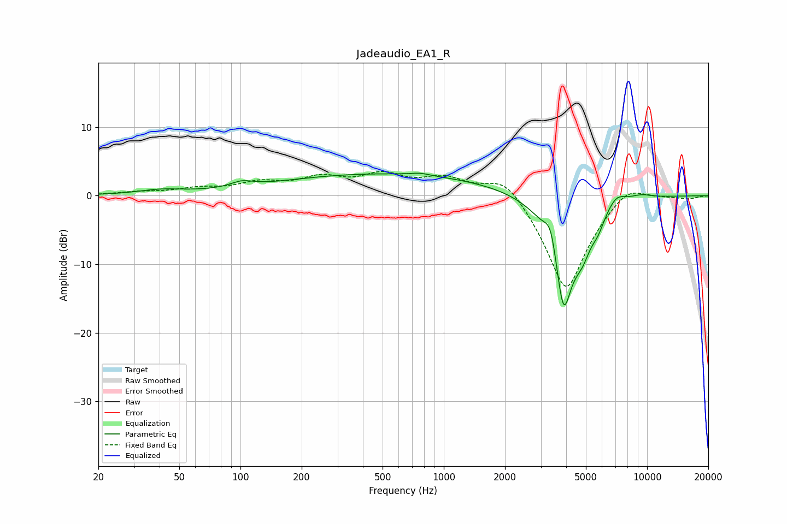

# Jadeaudio_EA1_R
See [usage instructions](https://github.com/jaakkopasanen/AutoEq#usage) for more options and info.

### Parametric EQs
Apply preamp of -3.4 dB when using parametric equalizer.

|   # | Type    |   Fc (Hz) |    Q |   Gain (dB) |
|-----|---------|-----------|------|-------------|
|   1 | Peaking |        41 | 1.27 |         0.7 |
|   2 | Peaking |       101 | 2.66 |         0.8 |
|   3 | Peaking |       524 | 0.25 |         3.2 |
|   4 | Peaking |       767 | 3.14 |         0.3 |
|   5 | Peaking |      3365 | 4.65 |         4.1 |
|   6 | Peaking |      3878 | 2.66 |       -16.6 |
|   7 | Peaking |      4812 | 3.1  |        -4   |
|   8 | Peaking |      5740 | 4.32 |        -1.8 |
|   9 | Peaking |      7069 | 3.06 |         1.6 |
|  10 | Peaking |      9330 | 2.3  |         0.6 |

### Fixed Band EQs
When using fixed band (also called graphic) equalizer, apply preamp of **-3.6 dB** (if available) and set gains manually with these parameters.

|   # | Type    |   Fc (Hz) |    Q |   Gain (dB) |
|-----|---------|-----------|------|-------------|
|   1 | Peaking |        31 | 1.41 |         0.4 |
|   2 | Peaking |        62 | 1.41 |         0.9 |
|   3 | Peaking |       125 | 1.41 |         1.6 |
|   4 | Peaking |       250 | 1.41 |         2.2 |
|   5 | Peaking |       500 | 1.41 |         2.7 |
|   6 | Peaking |      1000 | 1.41 |         2.4 |
|   7 | Peaking |      2000 | 1.41 |         3.7 |
|   8 | Peaking |      4000 | 1.41 |       -14.3 |
|   9 | Peaking |      8000 | 1.41 |         2.6 |
|  10 | Peaking |     16000 | 1.41 |        -0.4 |

### Graphs

