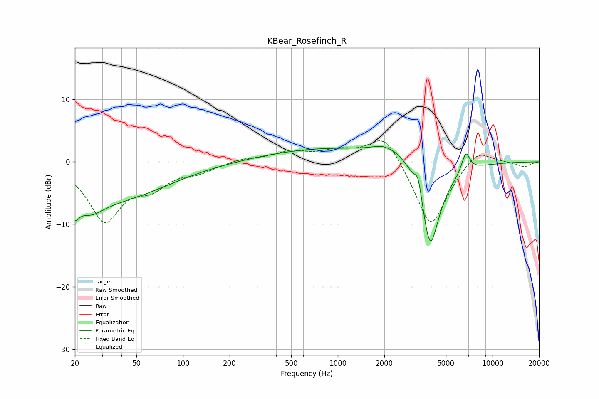

# KBear_Rosefinch_R
See [usage instructions](https://github.com/jaakkopasanen/AutoEq#usage) for more options and info.

### Parametric EQs
Apply preamp of -2.6 dB when using parametric equalizer.

|   # | Type    |   Fc (Hz) |    Q |   Gain (dB) |
|-----|---------|-----------|------|-------------|
|   1 | Peaking |        20 | 5.41 |        -2.8 |
|   2 | Peaking |        25 | 1.61 |        -3   |
|   3 | Peaking |        36 | 0.4  |        -5.7 |
|   4 | Peaking |       932 | 0.32 |         2.2 |
|   5 | Peaking |      1925 | 2.23 |         0.6 |
|   6 | Peaking |      2568 | 1.17 |         2.5 |
|   7 | Peaking |      3312 | 5.9  |         3.3 |
|   8 | Peaking |      3954 | 2.09 |       -15.3 |
|   9 | Peaking |      6678 | 5.06 |        -0.3 |
|  10 | Peaking |      6715 | 5.16 |         3.6 |

### Fixed Band EQs
When using fixed band (also called graphic) equalizer, apply preamp of **-3.4 dB** (if available) and set gains manually with these parameters.

|   # | Type    |   Fc (Hz) |    Q |   Gain (dB) |
|-----|---------|-----------|------|-------------|
|   1 | Peaking |        31 | 1.41 |        -9.1 |
|   2 | Peaking |        62 | 1.41 |        -3.2 |
|   3 | Peaking |       125 | 1.41 |        -1.3 |
|   4 | Peaking |       250 | 1.41 |         0.5 |
|   5 | Peaking |       500 | 1.41 |         1.5 |
|   6 | Peaking |      1000 | 1.41 |         1.5 |
|   7 | Peaking |      2000 | 1.41 |         4.9 |
|   8 | Peaking |      4000 | 1.41 |       -10.9 |
|   9 | Peaking |      8000 | 1.41 |         2.6 |
|  10 | Peaking |     16000 | 1.41 |        -0.8 |

### Graphs

