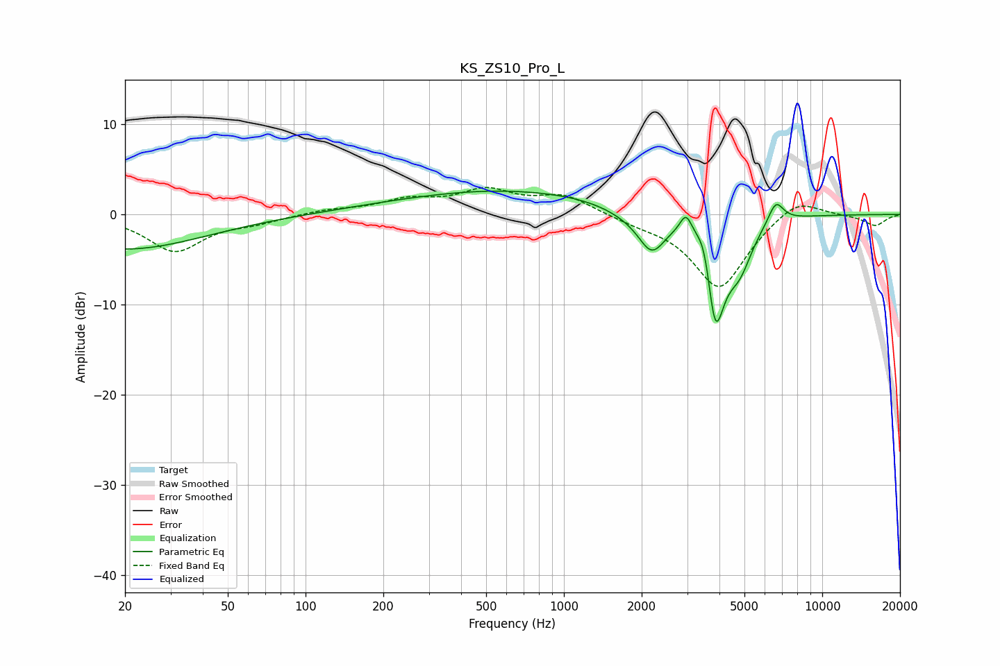

# KS_ZS10_Pro_L
See [usage instructions](https://github.com/jaakkopasanen/AutoEq#usage) for more options and info.

### Parametric EQs
Apply preamp of -2.7 dB when using parametric equalizer.

|   # | Type    |   Fc (Hz) |    Q |   Gain (dB) |
|-----|---------|-----------|------|-------------|
|   1 | Peaking |        20 | 0.46 |        -3.9 |
|   2 | Peaking |       516 | 0.69 |         0.2 |
|   3 | Peaking |       695 | 0.27 |         2.6 |
|   4 | Peaking |      1841 | 1.19 |        -1.2 |
|   5 | Peaking |      2189 | 2.74 |        -3.9 |
|   6 | Peaking |      2971 | 5.99 |         2.4 |
|   7 | Peaking |      3509 | 4.34 |         4.3 |
|   8 | Peaking |      3847 | 3.45 |       -13.2 |
|   9 | Peaking |      4792 | 2.8  |        -4.2 |
|  10 | Peaking |      6611 | 4.58 |         2.5 |

### Fixed Band EQs
When using fixed band (also called graphic) equalizer, apply preamp of **-3.1 dB** (if available) and set gains manually with these parameters.

|   # | Type    |   Fc (Hz) |    Q |   Gain (dB) |
|-----|---------|-----------|------|-------------|
|   1 | Peaking |        31 | 1.41 |        -4   |
|   2 | Peaking |        62 | 1.41 |        -0.7 |
|   3 | Peaking |       125 | 1.41 |         0.5 |
|   4 | Peaking |       250 | 1.41 |         1.4 |
|   5 | Peaking |       500 | 1.41 |         2.4 |
|   6 | Peaking |      1000 | 1.41 |         2   |
|   7 | Peaking |      2000 | 1.41 |        -0.7 |
|   8 | Peaking |      4000 | 1.41 |        -8.2 |
|   9 | Peaking |      8000 | 1.41 |         2.2 |
|  10 | Peaking |     16000 | 1.41 |        -1.2 |

### Graphs

