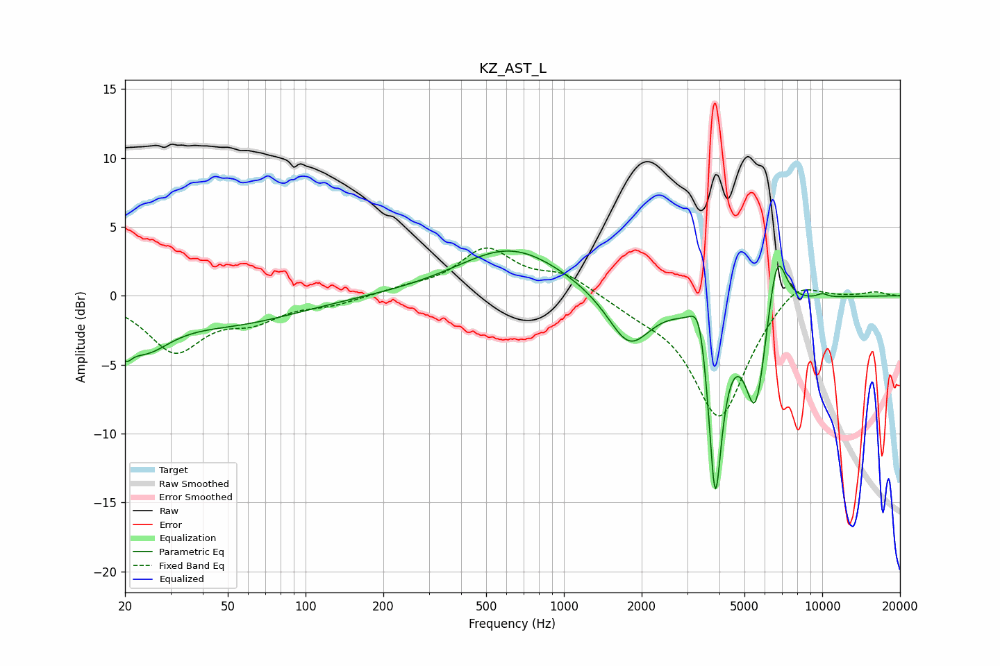

# KZ_AST_L
See [usage instructions](https://github.com/jaakkopasanen/AutoEq#usage) for more options and info.

### Parametric EQs
Apply preamp of -3.3 dB when using parametric equalizer.

|   # | Type    |   Fc (Hz) |    Q |   Gain (dB) |
|-----|---------|-----------|------|-------------|
|   1 | Peaking |        20 | 5.85 |        -1.5 |
|   2 | Peaking |        24 | 1.36 |        -3.1 |
|   3 | Peaking |        53 | 0.54 |        -1.8 |
|   4 | Peaking |       626 | 0.68 |         3.5 |
|   5 | Peaking |      1789 | 1.7  |        -3.9 |
|   6 | Peaking |      3350 | 4.44 |         3.3 |
|   7 | Peaking |      3852 | 5.02 |       -14.2 |
|   8 | Peaking |      5524 | 3.24 |        -8   |
|   9 | Peaking |      6666 | 3.72 |         5.2 |
|  10 | Peaking |     10000 | 5.99 |         0.3 |

### Fixed Band EQs
When using fixed band (also called graphic) equalizer, apply preamp of **-3.6 dB** (if available) and set gains manually with these parameters.

|   # | Type    |   Fc (Hz) |    Q |   Gain (dB) |
|-----|---------|-----------|------|-------------|
|   1 | Peaking |        31 | 1.41 |        -3.9 |
|   2 | Peaking |        62 | 1.41 |        -1.5 |
|   3 | Peaking |       125 | 1.41 |        -0.6 |
|   4 | Peaking |       250 | 1.41 |         0.4 |
|   5 | Peaking |       500 | 1.41 |         3.3 |
|   6 | Peaking |      1000 | 1.41 |         1.4 |
|   7 | Peaking |      2000 | 1.41 |        -0.8 |
|   8 | Peaking |      4000 | 1.41 |        -8.9 |
|   9 | Peaking |      8000 | 1.41 |         1.6 |
|  10 | Peaking |     16000 | 1.41 |         0.3 |

### Graphs

