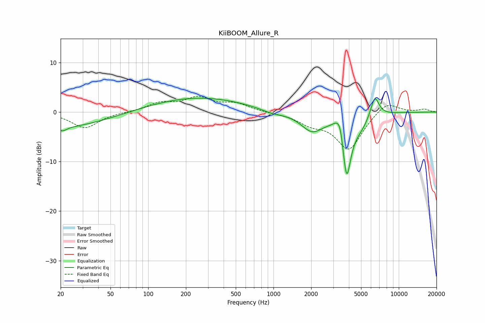

# KiiBOOM_Allure_R
See [usage instructions](https://github.com/jaakkopasanen/AutoEq#usage) for more options and info.

### Parametric EQs
Apply preamp of -2.9 dB when using parametric equalizer.

|   # | Type    |   Fc (Hz) |    Q |   Gain (dB) |
|-----|---------|-----------|------|-------------|
|   1 | Peaking |        20 | 0.38 |        -3.1 |
|   2 | Peaking |        21 | 4.31 |        -0.8 |
|   3 | Peaking |       248 | 0.36 |         3   |
|   4 | Peaking |       983 | 1.44 |        -0.8 |
|   5 | Peaking |      2031 | 1.59 |        -3.7 |
|   6 | Peaking |      3151 | 4.25 |         1.1 |
|   7 | Peaking |      3411 | 5.41 |         3.5 |
|   8 | Peaking |      3834 | 3.85 |       -12.7 |
|   9 | Peaking |      4984 | 2.09 |        -2.1 |
|  10 | Peaking |      6435 | 4.02 |         4.3 |

### Fixed Band EQs
When using fixed band (also called graphic) equalizer, apply preamp of **-3.3 dB** (if available) and set gains manually with these parameters.

|   # | Type    |   Fc (Hz) |    Q |   Gain (dB) |
|-----|---------|-----------|------|-------------|
|   1 | Peaking |        31 | 1.41 |        -3.2 |
|   2 | Peaking |        62 | 1.41 |        -0   |
|   3 | Peaking |       125 | 1.41 |         1.7 |
|   4 | Peaking |       250 | 1.41 |         2.7 |
|   5 | Peaking |       500 | 1.41 |         1.6 |
|   6 | Peaking |      1000 | 1.41 |        -0.1 |
|   7 | Peaking |      2000 | 1.41 |        -2   |
|   8 | Peaking |      4000 | 1.41 |        -7.5 |
|   9 | Peaking |      8000 | 1.41 |         2.4 |
|  10 | Peaking |     16000 | 1.41 |         0.6 |

### Graphs

