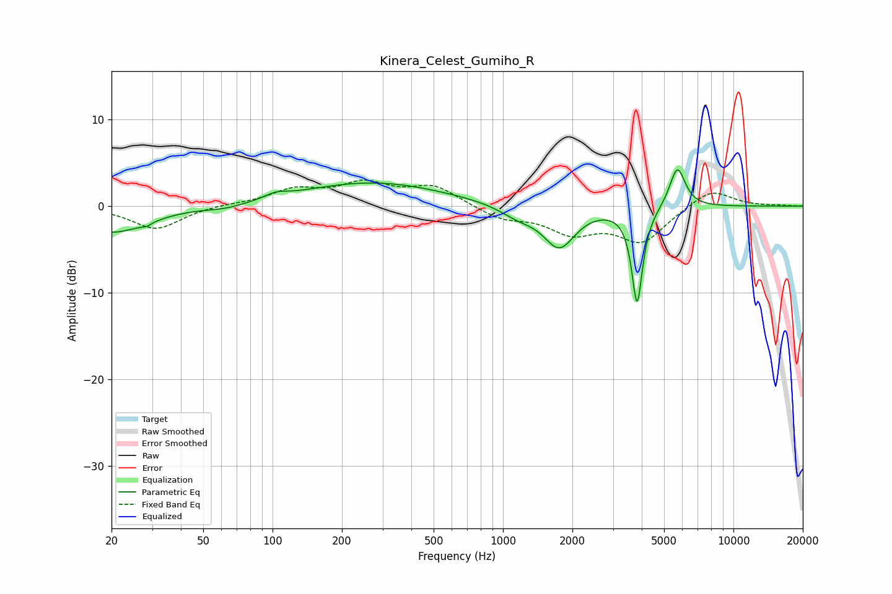

# Kinera_Celest_Gumiho_R
See [usage instructions](https://github.com/jaakkopasanen/AutoEq#usage) for more options and info.

### Parametric EQs
Apply preamp of -4.3 dB when using parametric equalizer.

|   # | Type    |   Fc (Hz) |    Q |   Gain (dB) |
|-----|---------|-----------|------|-------------|
|   1 | Peaking |        20 | 0.95 |        -3   |
|   2 | Peaking |        29 | 5.67 |        -1.9 |
|   3 | Peaking |        30 | 5.96 |         1.5 |
|   4 | Peaking |        63 | 1.58 |        -0.5 |
|   5 | Peaking |       104 | 3.07 |         0.6 |
|   6 | Peaking |       271 | 0.45 |         2.7 |
|   7 | Peaking |      1163 | 1.75 |        -1.2 |
|   8 | Peaking |      1756 | 2.06 |        -4.6 |
|   9 | Peaking |      3820 | 6    |       -11.2 |
|  10 | Peaking |      5711 | 4.08 |         4.8 |

### Fixed Band EQs
When using fixed band (also called graphic) equalizer, apply preamp of **-3.1 dB** (if available) and set gains manually with these parameters.

|   # | Type    |   Fc (Hz) |    Q |   Gain (dB) |
|-----|---------|-----------|------|-------------|
|   1 | Peaking |        31 | 1.41 |        -2.7 |
|   2 | Peaking |        62 | 1.41 |         0.2 |
|   3 | Peaking |       125 | 1.41 |         1.8 |
|   4 | Peaking |       250 | 1.41 |         2.4 |
|   5 | Peaking |       500 | 1.41 |         2.2 |
|   6 | Peaking |      1000 | 1.41 |        -1.4 |
|   7 | Peaking |      2000 | 1.41 |        -2.8 |
|   8 | Peaking |      4000 | 1.41 |        -4   |
|   9 | Peaking |      8000 | 1.41 |         2.1 |
|  10 | Peaking |     16000 | 1.41 |         0.1 |

### Graphs

