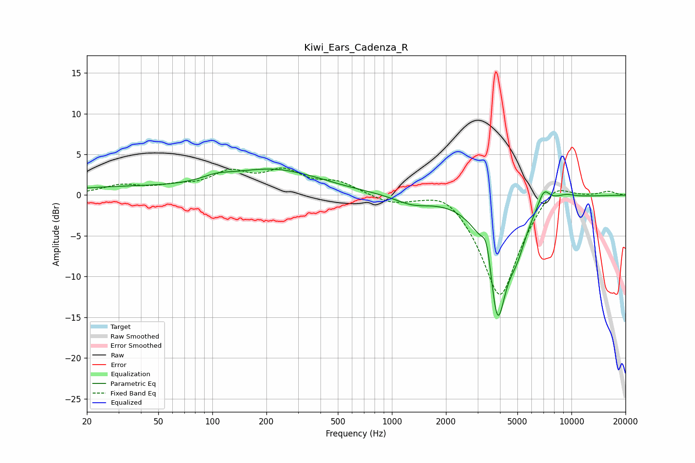

# Kiwi_Ears_Cadenza_R
See [usage instructions](https://github.com/jaakkopasanen/AutoEq#usage) for more options and info.

### Parametric EQs
Apply preamp of -3.3 dB when using parametric equalizer.

|   # | Type    |   Fc (Hz) |    Q |   Gain (dB) |
|-----|---------|-----------|------|-------------|
|   1 | Peaking |        30 | 0.42 |         0.9 |
|   2 | Peaking |       105 | 1.74 |         0.6 |
|   3 | Peaking |       218 | 0.54 |         3   |
|   4 | Peaking |       406 | 2.3  |         0   |
|   5 | Peaking |      1300 | 1.44 |        -1   |
|   6 | Peaking |      3379 | 5.36 |         3.6 |
|   7 | Peaking |      3870 | 2.54 |       -14.8 |
|   8 | Peaking |      4980 | 2.74 |        -3.3 |
|   9 | Peaking |      7020 | 4.04 |         2.2 |
|  10 | Peaking |      9213 | 2.2  |         0.6 |

### Fixed Band EQs
When using fixed band (also called graphic) equalizer, apply preamp of **-3.4 dB** (if available) and set gains manually with these parameters.

|   # | Type    |   Fc (Hz) |    Q |   Gain (dB) |
|-----|---------|-----------|------|-------------|
|   1 | Peaking |        31 | 1.41 |         1.1 |
|   2 | Peaking |        62 | 1.41 |         0.8 |
|   3 | Peaking |       125 | 1.41 |         2.5 |
|   4 | Peaking |       250 | 1.41 |         2.6 |
|   5 | Peaking |       500 | 1.41 |         1.4 |
|   6 | Peaking |      1000 | 1.41 |        -0.9 |
|   7 | Peaking |      2000 | 1.41 |         1.5 |
|   8 | Peaking |      4000 | 1.41 |       -12.8 |
|   9 | Peaking |      8000 | 1.41 |         2.4 |
|  10 | Peaking |     16000 | 1.41 |         0.5 |

### Graphs

