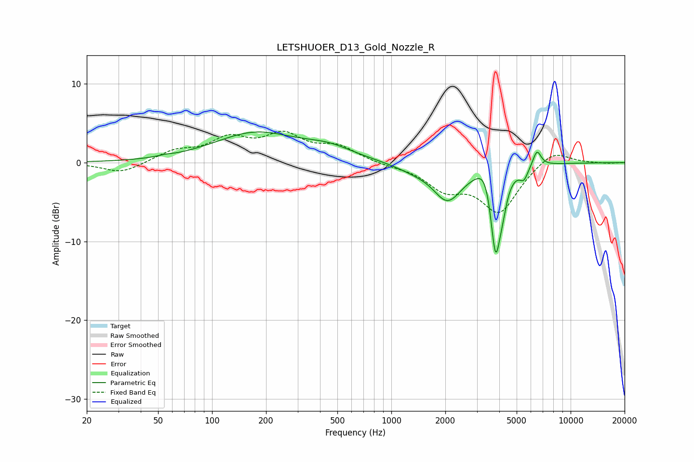

# LETSHUOER_D13_Gold_Nozzle_R
See [usage instructions](https://github.com/jaakkopasanen/AutoEq#usage) for more options and info.

### Parametric EQs
Apply preamp of -4.0 dB when using parametric equalizer.

|   # | Type    |   Fc (Hz) |    Q |   Gain (dB) |
|-----|---------|-----------|------|-------------|
|   1 | Peaking |        55 | 4.33 |         0.1 |
|   2 | Peaking |       174 | 0.61 |         3.7 |
|   3 | Peaking |       449 | 1.01 |         1.3 |
|   4 | Peaking |      1318 | 1.32 |        -0.7 |
|   5 | Peaking |      2059 | 1.75 |        -4.5 |
|   6 | Peaking |      3353 | 3.23 |         2.5 |
|   7 | Peaking |      3813 | 4.76 |       -11.1 |
|   8 | Peaking |      4171 | 5.7  |        -2   |
|   9 | Peaking |      5486 | 5.99 |        -1.5 |
|  10 | Peaking |      6490 | 6    |         2.1 |

### Fixed Band EQs
When using fixed band (also called graphic) equalizer, apply preamp of **-4.1 dB** (if available) and set gains manually with these parameters.

|   # | Type    |   Fc (Hz) |    Q |   Gain (dB) |
|-----|---------|-----------|------|-------------|
|   1 | Peaking |        31 | 1.41 |        -1.4 |
|   2 | Peaking |        62 | 1.41 |         1.3 |
|   3 | Peaking |       125 | 1.41 |         2.7 |
|   4 | Peaking |       250 | 1.41 |         3.2 |
|   5 | Peaking |       500 | 1.41 |         1.9 |
|   6 | Peaking |      1000 | 1.41 |        -0.3 |
|   7 | Peaking |      2000 | 1.41 |        -3   |
|   8 | Peaking |      4000 | 1.41 |        -6.1 |
|   9 | Peaking |      8000 | 1.41 |         1.8 |
|  10 | Peaking |     16000 | 1.41 |        -0.1 |

### Graphs

