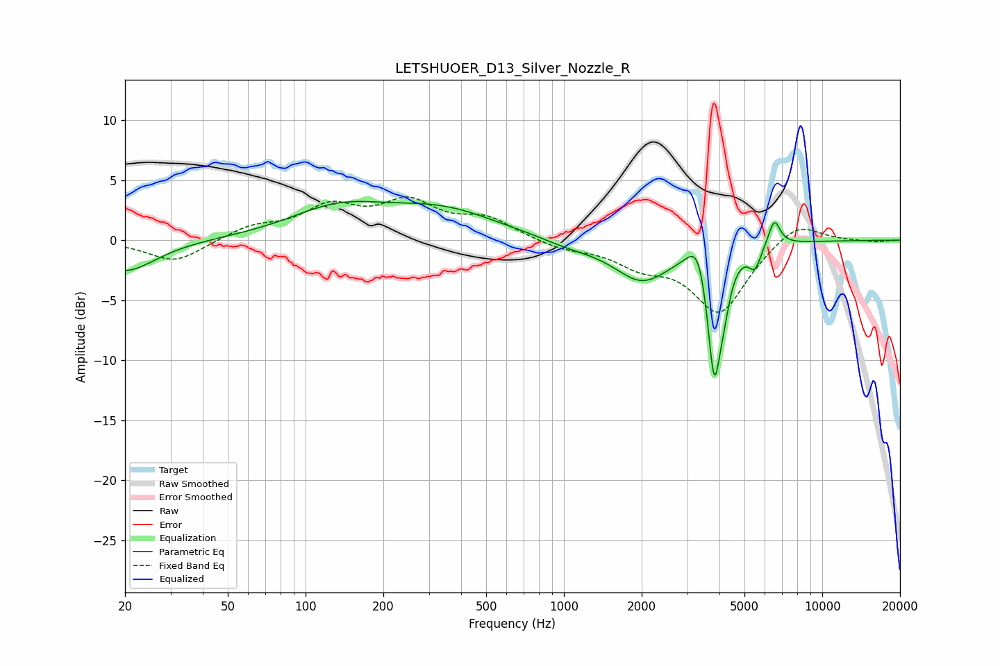

# LETSHUOER_D13_Silver_Nozzle_R
See [usage instructions](https://github.com/jaakkopasanen/AutoEq#usage) for more options and info.

### Parametric EQs
Apply preamp of -3.3 dB when using parametric equalizer.

|   # | Type    |   Fc (Hz) |    Q |   Gain (dB) |
|-----|---------|-----------|------|-------------|
|   1 | Peaking |        20 | 1.21 |        -2.6 |
|   2 | Peaking |       133 | 0.75 |         2.4 |
|   3 | Peaking |       339 | 0.66 |         2.3 |
|   4 | Peaking |      1048 | 1.35 |        -0.5 |
|   5 | Peaking |      2007 | 1.28 |        -3.3 |
|   6 | Peaking |      3311 | 3.71 |         2.7 |
|   7 | Peaking |      3819 | 5.18 |       -10.9 |
|   8 | Peaking |      4176 | 5.99 |        -1.9 |
|   9 | Peaking |      5489 | 5.95 |        -1.7 |
|  10 | Peaking |      6520 | 6    |         2.2 |

### Fixed Band EQs
When using fixed band (also called graphic) equalizer, apply preamp of **-3.7 dB** (if available) and set gains manually with these parameters.

|   # | Type    |   Fc (Hz) |    Q |   Gain (dB) |
|-----|---------|-----------|------|-------------|
|   1 | Peaking |        31 | 1.41 |        -1.9 |
|   2 | Peaking |        62 | 1.41 |         1   |
|   3 | Peaking |       125 | 1.41 |         2.5 |
|   4 | Peaking |       250 | 1.41 |         2.9 |
|   5 | Peaking |       500 | 1.41 |         1.7 |
|   6 | Peaking |      1000 | 1.41 |        -0.7 |
|   7 | Peaking |      2000 | 1.41 |        -1.7 |
|   8 | Peaking |      4000 | 1.41 |        -5.9 |
|   9 | Peaking |      8000 | 1.41 |         1.8 |
|  10 | Peaking |     16000 | 1.41 |        -0.2 |

### Graphs

