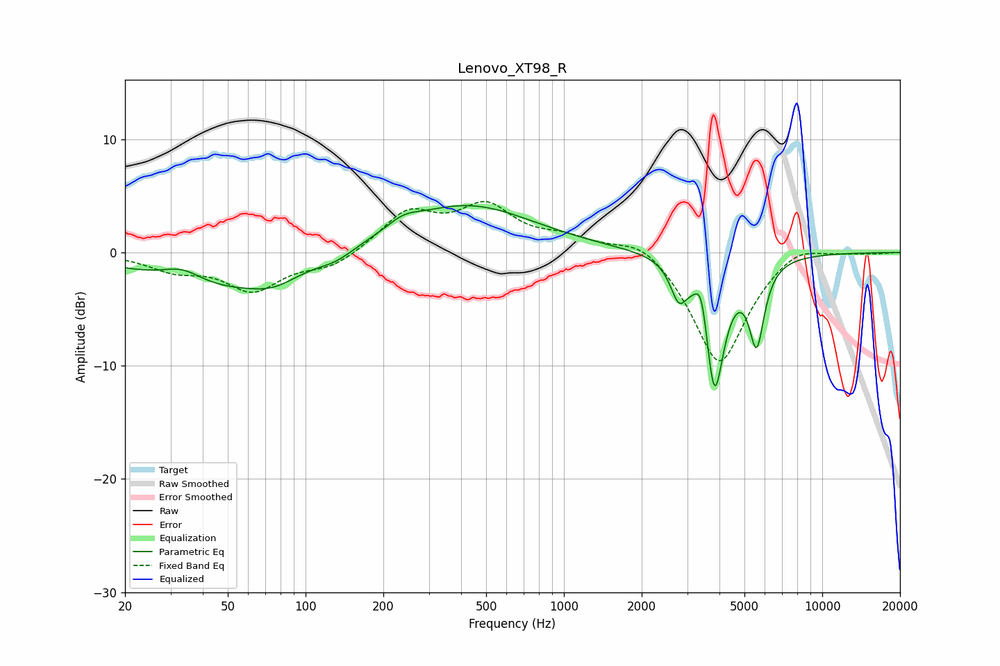

# Lenovo_XT98_R
See [usage instructions](https://github.com/jaakkopasanen/AutoEq#usage) for more options and info.

### Parametric EQs
Apply preamp of -4.2 dB when using parametric equalizer.

|   # | Type    |   Fc (Hz) |    Q |   Gain (dB) |
|-----|---------|-----------|------|-------------|
|   1 | Peaking |        33 | 1.81 |         1.3 |
|   2 | Peaking |        47 | 0.51 |        -3.2 |
|   3 | Peaking |        75 | 1.56 |        -1   |
|   4 | Peaking |       131 | 2.1  |        -0.7 |
|   5 | Peaking |       238 | 2.21 |         0.9 |
|   6 | Peaking |       419 | 0.54 |         4.2 |
|   7 | Peaking |      2784 | 4.5  |        -2.9 |
|   8 | Peaking |      3410 | 6    |         3.2 |
|   9 | Peaking |      3825 | 3.59 |       -12.2 |
|  10 | Peaking |      5574 | 4.7  |        -7   |

### Fixed Band EQs
When using fixed band (also called graphic) equalizer, apply preamp of **-4.6 dB** (if available) and set gains manually with these parameters.

|   # | Type    |   Fc (Hz) |    Q |   Gain (dB) |
|-----|---------|-----------|------|-------------|
|   1 | Peaking |        31 | 1.41 |        -1.4 |
|   2 | Peaking |        62 | 1.41 |        -3.2 |
|   3 | Peaking |       125 | 1.41 |        -1.3 |
|   4 | Peaking |       250 | 1.41 |         3.4 |
|   5 | Peaking |       500 | 1.41 |         3.8 |
|   6 | Peaking |      1000 | 1.41 |         1.1 |
|   7 | Peaking |      2000 | 1.41 |         1.6 |
|   8 | Peaking |      4000 | 1.41 |       -10.1 |
|   9 | Peaking |      8000 | 1.41 |         1.2 |
|  10 | Peaking |     16000 | 1.41 |        -0.1 |

### Graphs

